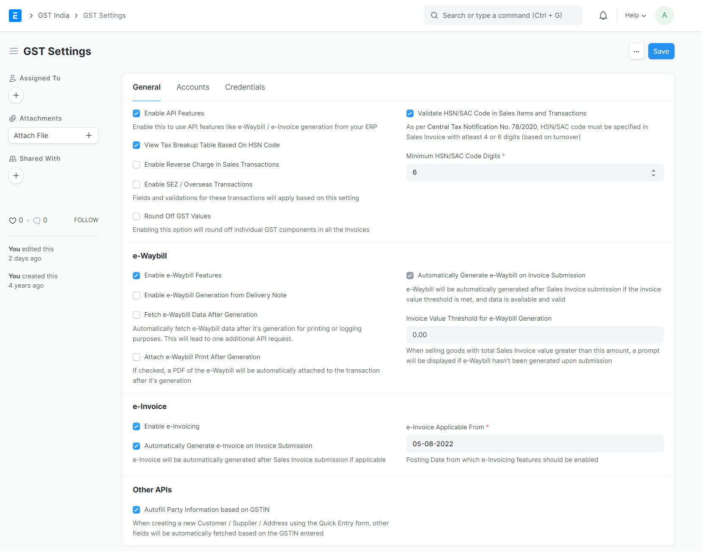

# Migrating from ERPNext Version 13

Migrations are never easy, with a lot of uncertainties attached to them.

To simplify this, we have a guide for changes we have made to version 13 and how you can tackle them.

This guide is particular to changes with India Compliance App.

::: info
We have appropriate patches to ensure a smooth migration, but there can be some ambiguity, which we have not touched. Make sure you have got all this right before you start using your systems.
:::

## First Steps

First, you shall be required to upgrade your ERPNext site from version 13 to version 14.

::: warning
India-specific features have been removed from ERPNext, and you shall be required to install the new app, India Compliance.
:::

Once done, you must add India Compliance App and install it as per instructions [here](installation#self-hosted).

Now we shall cover changes to specific features below.

## GST Settings

There has been a complete revamp of GST Settings and its features. Kindly review them individually once again and check if the configurations work as you expect.

For more details, refer to the GST settings documentation.

## Company Setup

It is newly introduced to v14. You may please refer to the documentation here and make necessary changes if needed.

Please check that GSTIN and GST Category are present in the company and address doctypes. It will ensure appropriate validations apply at the transaction level.

## GST Accounts

There is a slight change in how this works in v14 instead of v13. We have brought standardisation in implementing Tax Accounts for organisations of all sizes. You may refer to the documentation here and make appropriate changes.

**How is it different from v13?**

- With v13, there were no restrictions on how many accounts you could have for one company.
- With v14, you should have one and only one GST account of a specific type for a company.
- They are now better defined with version 14.

With this standardisation, you will see a lot of improvements in validations and how taxes are implemented in v14.

## Party and Address Doctypes

There has been a change in how GST details are saved in party and address doctypes. Also, there is a slight difference in how they are auto-populated. You may refer to the documentation here and make appropriate changes.

**How is it different from v13?**

- You now have GST Category and GSTIN for Address and Party Doctypes (Customer and Supplier). This is to ensure completeness of information, default behaviour and valid transactions.
- "URP" / "NA" is no longer acceptable for empty or No GSTIN. Just keep it blank.
- Improved validations to ensure you get it right.

**What care is needed post migration?**

We do have a patch to ensure this works, but it doesn't work where there is ambiguity or maybe your existing database is not complete.
Just filter out for following in Customer / Supplier / Address doctypes and fix them.

- GST Category *is* not set.
- GST Category *not in* Unregistered, Overseas and GSTIN *is* not set.
- For addresses, you can have an additional filter. Check for link doctype *is in* Customer, Supplier, Company.

All this is to ensure you have GSTIN and GST Category appropriately set for your parties and their addresses. It will ensure smoother transactions (without validation failures) in the future.

## Fields restructuring

With v14, there is consistency with the fields available in Transaction DocTypes throughout sales and purchase cycles.

- There are minor changes with the placements of the fields and their types.
- Fields that may need user inputs have been brought up from GST Section below.
- *Is Reverse Charge* and *Is Export with Payment of Tax* is now a checkbox.
- *GST Category* is now closer to GSTIN.

## Major refactor for e-Invoice

There has been a major refactor and change in the e-Invoice implementation. It is to make it more consistent, efficient, cleaner and wholesome with many fixes. You can go through detailed documentation on how it works here.

The following changes may need to be incorporated into the e-Invoice implementation for your site.

### E Invoice Settings

It has been deprecated. These have been moved to GST Settings. Make sure you have the correct configurations migrated.

### E Invoice Request Log

It has been migrated to Integration Request.

### e-Invoice Fields Restructuring

Sales Invoice is now much lighter with fewer and most necessary e-Invoice fields.

Fields like Acknowledgement No and Date and other relevant fields have been moved to e-Invoice Log, which is lined to Sales Invoice.

### e-Invoice QR and Print Format

e-Invoice QR was getting attached to the Sales Invoice, which was unnecessary and could cause problems. If you use one, you must fix your custom print format, and you can check the newer implementation here.

## Doctypes and Reports Deprecated

::: danger
Following reports and doctypes have been deprecated starting v14
:::

- E-Invoice Settings (Moved to GST Settings)
- E-Invoice Request Log (Migrated to Integration Request)
- Report E-Invoice Summary
- Report Eway Bill
