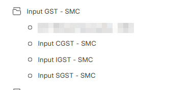
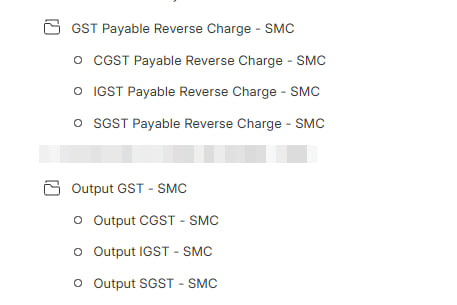
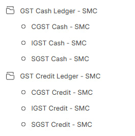
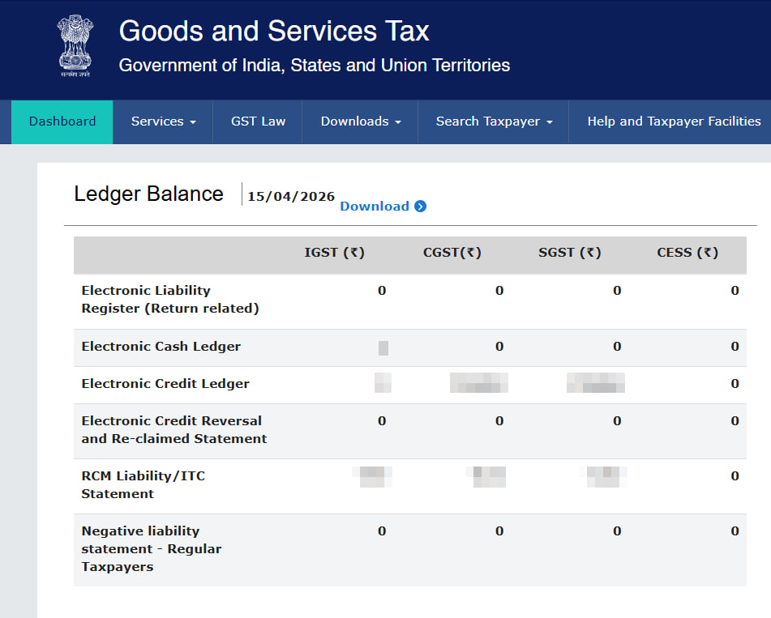
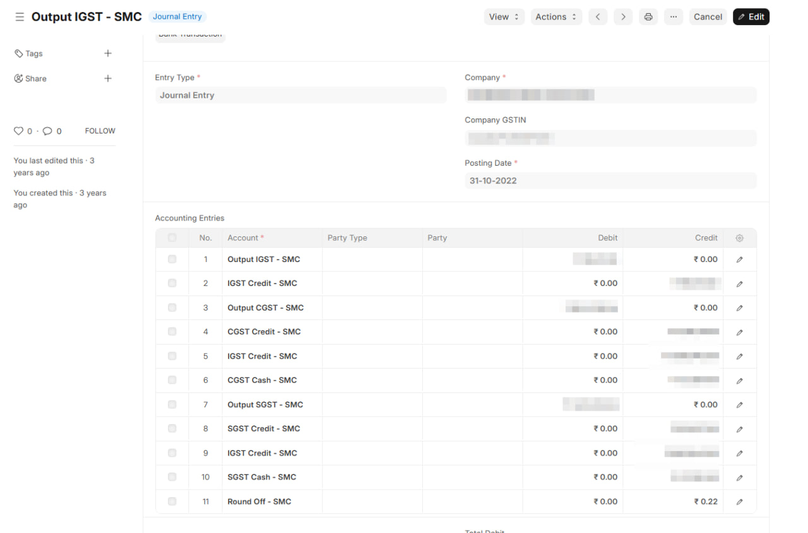
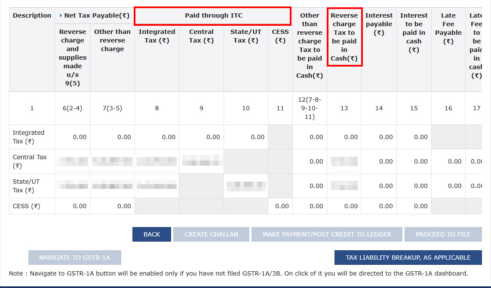
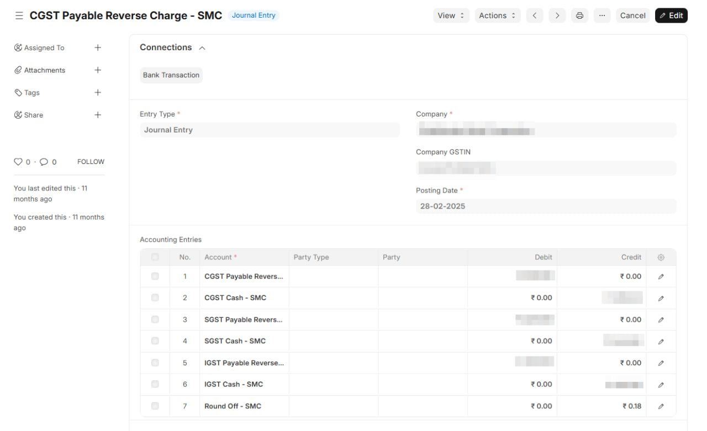

<PostDetail>

Filing GSTR-3B is only half the job. The other half is making sure your books reflect what actually happened — inputs claimed, liability set off, cash paid to the government. Most businesses get the filing right but skip the accounting entries, and that's where the mismatch builds up over time.

## The Accounts You Need

A typical GST setup in your books will have:

**Input Accounts** — one each for CGST, SGST, IGST (and Cess, if applicable). These track the GST you've paid on purchases — what you can potentially claim.

**Output Accounts** — one each for CGST, SGST, IGST. These track the GST you've collected on sales — your liability to the government.

**RCM Accounts** — needed only if you have purchases under Reverse Charge. These track tax liability you owe directly to the government instead of the supplier collecting it.

## Government Ledgers — and Why You Should Mirror Them

The GST portal maintains ledgers for every GSTIN, visible under Services → Ledger (or summary on the dashboard):

**Electronic Credit Ledger** — your pool of claimed input tax credit with the government. You use this to pay off liability.

**Electronic Cash Ledger** — money you've deposited with the government via challan. Liability that credit can't cover is paid from here.

If you create matching accounts in your books (GST Credit Ledger, GST Cash Ledger), you can reconcile your balances with the portal at any time. Deviations become immediately visible.

::: info
The government also maintains an **Electronic Liability Register** — this records what you've declared as payable in GSTR-3B Table 3.1 (output liability + RCM). Ideally, this matches your Output GST + RCM Payable balances. You can optionally maintain a Liability account in your books too, where Output and RCM move into Liability first, and then Liability is set off against Credit and Cash. For most businesses, directly setting off Output and RCM against Credit and Cash (as shown below) is simpler and works just fine.
:::

## The Entries

Let's say in a given month:

- Purchased goods worth ₹1,000 + ₹100 GST
- Sold goods worth ₹2,000 + ₹200 GST
- Paid ₹150 to the government via challan
- Claimed ₹50 of input credit in GSTR-3B (out of ₹100 available)

### 1. Input GST on Purchase

Posted automatically when you book a purchase invoice.

| Account | Debit (₹) | Credit (₹) |
|---|---|---|
| Input GST | 100 | |
| Creditor (Supplier) | | 100 |

### 2. Output GST on Sale

Posted automatically when you create a sales invoice.

| Account | Debit (₹) | Credit (₹) |
|---|---|---|
| Debtor (Customer) | 200 | |
| Output GST | | 200 |

### 3. Cash Deposited with Government

You deposit money via GST challan before filing. This goes into the Electronic Cash Ledger on the portal.

| Account | Debit (₹) | Credit (₹) |
|---|---|---|
| GST Cash Ledger | 150 | |
| Bank | | 150 |

### 4. Claiming Input Credit (per GSTR-3B)

You declare how much input credit you're claiming in GSTR-3B. This may differ from what's in your books — it depends on how your suppliers have filed their returns and what shows up in your GSTR-2B.

Here, you claim ₹50 out of ₹100 available. The remaining ₹50 stays in Input GST for future periods.

| Account | Debit (₹) | Credit (₹) |
|---|---|---|
| GST Credit Ledger | 50 | |
| Input GST | | 50 |

### 5. Setting Off Liability (per GSTR-3B)

Output liability of ₹200 is set off using credit and cash.

| Account | Debit (₹) | Credit (₹) |
|---|---|---|
| Output GST | 200 | |
| GST Credit Ledger | | 50 |
| GST Cash Ledger | | 150 |

Output GST is now zero. Credit and Cash ledger balances reduce accordingly.

This is what the corresponding GSTR-3B Table 3 payment summary looks like on the portal — the ITC and cash columns should match your journal entry.

::: tip
After posting all entries, your GST Cash Ledger and GST Credit Ledger balances should match the GST portal. If they don't, something needs investigating.
:::

## Reverse Charge (RCM)

Two additional entries if you have RCM purchases.

### RCM on Purchase

You get the input credit but also take on the liability to pay tax directly.

| Account | Debit (₹) | Credit (₹) |
|---|---|---|
| Input GST | 50 | |
| RCM Payable | | 50 |

### RCM Liability Set-Off

RCM liability is paid from your Cash Ledger when filing GSTR-3B.

| Account | Debit (₹) | Credit (₹) |
|---|---|---|
| RCM Payable | 50 | |
| GST Cash Ledger | | 50 |

::: warning
Your total cash deposit needs to cover both regular liability and RCM. In this example, the actual bank payment would be ₹200 (₹150 regular + ₹50 RCM), not ₹150.
:::

## After All Entries Are Posted

Verify these balances:

- **Output GST** — zero (fully set off)
- **RCM Payable** — zero (fully paid)
- **Input GST** — only unclaimed balance remaining (₹50 in our example)
- **GST Cash Ledger** — matches the portal's Electronic Cash Ledger
- **GST Credit Ledger** — matches the portal's Electronic Credit Ledger

## Recording These in ERPNext / India Compliance App

Steps 1 and 2 (purchase and sales GST) are posted automatically when you submit invoices.

Steps 3 through 5 (and RCM entries) are manual — use **Journal Entry** for each.

1. Go to **Journal Entry**, select Entry Type as "Journal Entry"
2. Add accounts and amounts as shown above
3. Set **Posting Date** to the GSTR-3B filing period
4. Add a remark like "GSTR-3B set-off for March 2026"

::: tip
Create a **Journal Entry template** in ERPNext for these recurring entries. Just update the amounts each month.
:::

</PostDetail>
