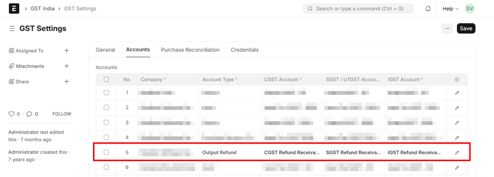
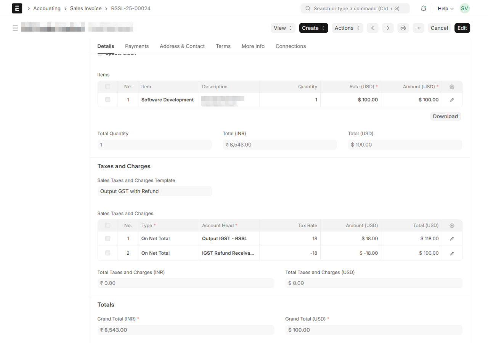
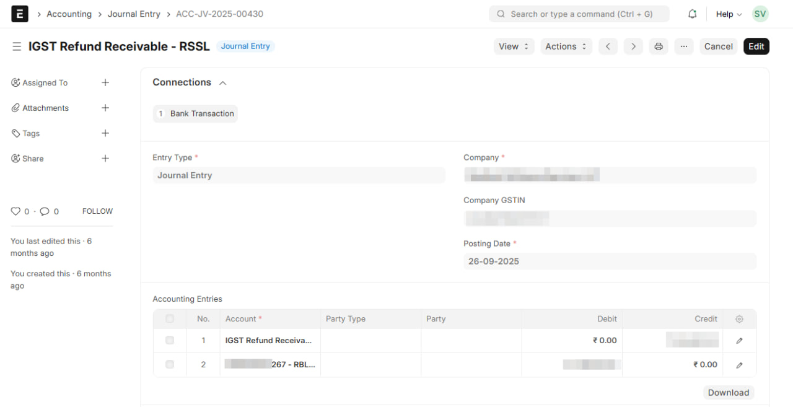
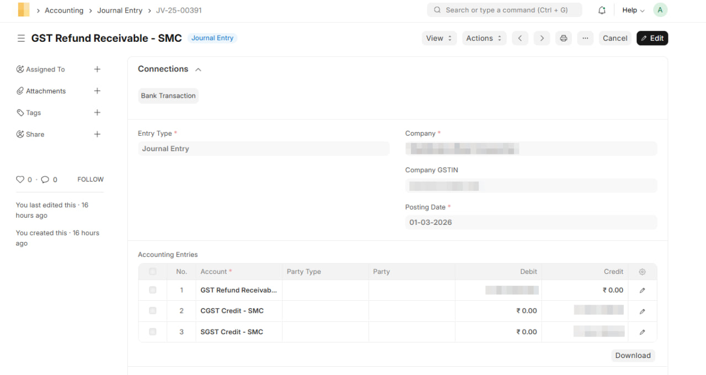

<PostDetail>

GST refunds come in two shapes

- one where you paid the tax and want it back against a specific invoice, and
- one where your credit ledger piles up faster than your liability can use it.

Each needs a different book treatment.

## Refund Receivable Accounts — Set These Up First

Every rupee you expect back from the government is a receivable. Create one account per GST component — **IGST Refund Receivable**, **CGST Refund Receivable**, **SGST Refund Receivable** — under **Current Assets**. Alternatively, you can just track one account for all GST components. These track the amount pending with the portal until the refund hits your bank.

In India Compliance App, you can configure these directly in **GST Settings → Output Refund Accounts**. Once set, they become available for sales transactions that need refund treatment.

*GST Settings → Accounts tab — Account Type "Output Refund" with CGST, SGST, and IGST Refund Receivable mapped*

## Case 1 — Refund Against a Specific Sales Invoice

This applies when you pay GST on a sale and then claim it back — most commonly **Export with Payment of IGST**. The tax goes to the government as a normal output liability, but the customer doesn't pay it, so you claim it as a refund.

The trick: on the sales invoice, route the tax through the Refund Receivable account instead of adding it to the customer's total. The invoice then shows only the net amount payable by the customer.

### Example — Export with IGST

Export sale of ₹10,000 with 18% IGST:

| Account | Debit (₹) | Credit (₹) |
|---|---|---|
| Debtor (Customer) | 10,000 | |
| IGST Refund Receivable | 1,800 | |
| Sales | | 10,000 |
| Output IGST | | 1,800 |

Customer owes only ₹10,000. The ₹1,800 IGST is tracked as a receivable from the government.

*Export sales invoice — Output IGST at +18% is offset by IGST Refund Receivable at -18%, keeping the customer's total at net of tax*

Output IGST still shows as a liability and gets set off in the normal GSTR-3B cycle (against credit or cash). That part works exactly like a domestic sale.

### When the Refund is Received

The portal processes the refund and credits your bank. Book the receipt against the receivable:

| Account | Debit (₹) | Credit (₹) |
|---|---|---|
| Bank | 1,800 | |
| IGST Refund Receivable | | 1,800 |

*Journal Entry booking the refund receipt — Bank debited, IGST Refund Receivable credited*

::: tip
Track refund applications in a separate register (date applied, ARN, amount, status). Your IGST Refund Receivable balance should equal the sum of pending ARNs at any time. A mismatch points to a missed entry or a refund that's been delayed on the portal.
:::

## Case 2 — Other Refunds

This covers refunds that aren't tied to a specific sales invoice. The two common cases:

- **Export without Payment of IGST** (under LUT) — no output GST on the export, but your input credit keeps building because you're not using it to set off any liability.
- **Inverted Duty Structure** — output tax rate is lower than input tax rate, so credit accumulates faster than it can be consumed.

In both, the refund is against accumulated ITC sitting in your Electronic Credit Ledger. There's no sales-side entry, but the refund flow has two stages in your books — because the portal reduces your credit ledger the moment you file, not when the money arrives.

### When the Refund is Filed

The moment you file the refund application, the portal debits your Electronic Credit Ledger — that ITC is no longer usable for set-off. Your books should reflect this immediately by moving the amount out of GST Credit Ledger and into a receivable.

Say ₹50,000 of accumulated IGST credit is being claimed as refund.

| Account | Debit (₹) | Credit (₹) |
|---|---|---|
| IGST Refund Receivable | 50,000 | |
| GST Credit Ledger | | 50,000 |

*Journal Entry on refund filing — GST Refund Receivable debited, CGST and SGST Credit ledgers credited*

After this entry, your GST Credit Ledger still matches the portal, and the ₹50,000 is tracked as pending recovery from the government.

### When the Refund is Received

The portal processes the application and credits your bank. Clear the receivable:

| Account | Debit (₹) | Credit (₹) |
|---|---|---|
| Bank | 50,000 | |
| IGST Refund Receivable | | 50,000 |

Same structure as the Case 1 receipt entry above — Bank debited, Refund Receivable credited.

::: info
If the refund is rejected or partially sanctioned, the portal re-credits the unclaimed portion back to your Electronic Credit Ledger. Reverse that amount in your books — debit GST Credit Ledger, credit IGST Refund Receivable — so both sides stay in sync.
:::

## Recording These in ERPNext / India Compliance App

**Setup (one time):** Go to **GST Settings → Output Refund Accounts** and map your IGST, CGST, and SGST refund receivable accounts.

**Export with GST invoices:** Use the appropriate export GST treatment on the Sales Invoice. When the refund account is configured, the tax posts to the receivable instead of Output GST hitting the customer's total.

**Refund entries:** Use **Journal Entry** for each stage.

- **On filing (Case 2 only):** Entry Type "Journal Entry". Debit the relevant Refund Receivable account, credit GST Credit Ledger. Posting date = date of filing on the portal.
- **On receipt (both cases):** Entry Type "Bank Entry". Debit Bank, credit the Refund Receivable account. Posting date = date the refund hits your bank.

Add a remark with the ARN and refund period on every entry — makes reconciliation trivial later.

</PostDetail>
