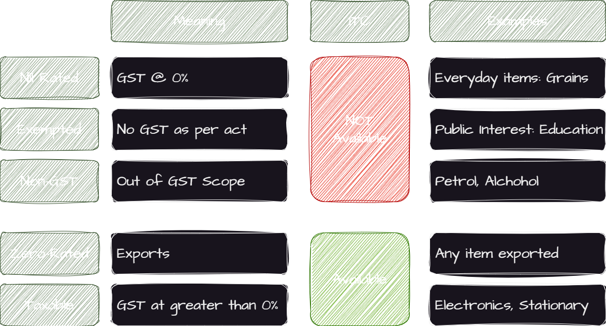

<PostDetail>

In India Compliance App, we have different types of GST treatments. These are Nil-Rated, Exempt, Non-GST, Zero Rated and Taxable supplies. In this blog, we'll understand the difference between these treatments and how they are handled in the India Compliance App.

## GST Treatments

Following table summarizes the GST treatments:

### Nil-Rated

Nil-rated supplies are those supplies on which the GST rate is 0%. They may include daily essentials. Input tax credit is not available on the purchase of goods or services that are used to make nil-rated supplies.

### Exempt

Exempt supplies are those supplies that are not taxed under GST in Public Interest. This may be appliable to certain goods or transactions. Input tax credit is not available on the purchase of goods or services that are used to make exempt supplies.

### Non-GST

Non-GST supplies are those supplies that are not covered under GST. Input tax credit is not available on the purchase of goods or services that are used to make non-GST supplies.

### Zero-Rated

Supplies that are made to SEZ (Special Economic Zone) or made overseas come under zero-rated supplies. The supplier can claim input tax credit on the purchase of goods or services that are used to make zero-rated supplies. This is irrespective of the fact that the supply is taxable or exempt or nil-rated. 

### Taxable

Other supplies, which are taxed under GST, are considered taxable supplies.

## What is the key difference between Nil-Rated and Exempt Supplies?

- Nil-Rated: Applies to a specific list of goods and services on which the GST rate is 0%. *Central Board of Direct Taxes* (CBDT) has the authority to decide which goods and services are nil-rated and notify the amendments in the rates.
- Exempted: Applies to goods and services that are not taxed under GST in public interest. The *government* (on recommendations of CBDT) can exempt certain goods and services from GST. Exemption may also be granted to certain transactions or persons.

## How are these treatments handled in the India Compliance App?

### Transactions

In the India Compliance App, there is a `GST Treatment` field in the Item Tax template. This field is used to define the GST treatment for the item. It can be set to Nil-Rated, Exempt, Non-GST or Taxable (but not Zero-Rated).

Based on Item Tax template, the GST treatment is fetched in the Transactions.

If the transaction is Export or supplies to SEZ, the GST treatment is set to Zero-Rated for all items.

### e-Invoice

- Fully Non Taxable Invoice: If all items are either Nil-Rated, Exempt or Non-GST, the e-Invoice is not applicable.
- Partially Non Taxable Invoice: If some items are Nil-Rated, Exempt or Non-GST, the e-Invoice is applicable if it's a B2B transaction. Non-Taxable items are considered as other charges in the e-Invoice.
- Zero-Rated Invoice: e-Invoice is applicable and hence will be created.

### GSTR-1

- Fully Non Taxable Invoice: If all items are either Nil-Rated, Exempt or Non-GST, it is fully displayed in Nil-Exempt section in GSTR-1.
- Partially Non Taxable Invoice: If some items are Nil-Rated, Exempt or Non-GST, it is split into Taxable and Nil-Exempt sections in GSTR-1. Taxable items will be displayed in B2B or B2C sections as the case may be. Nil-Exempt items will be displayed in Nil-Exempt section.
- Zero-Rated Invoice: It is displayed in B2B (if SEZ) or Export section in GSTR-1.

</PostDetail>
