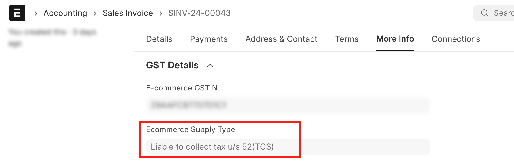
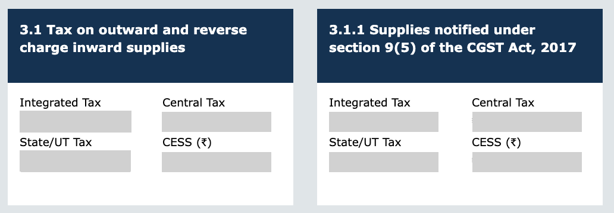

<PostDetail>

Recently government has introduced a new section in GSTR-1 reporting for Sales through e-commerce operators. This new section is Table 14 in GSTR-1 filing.

## Understanding E-commerce Transactions

When a supplier sells goods or services through an e-commerce operator, he is required to report such transactions in Table 14 of GSTR-1. This is in addition to the regular reporting of sales in GSTR-1 under existing categories (eg: B2B or B2C).

This is further divided into two categories:

- Section 52: TCS (Tax Collected at Source) is applicable for the e-commerce operator. He is required to collect tax from the supplier at the time of payment and deposit it with the government. The Liability to pay GST is on Supplier. eg: Sales through Amazon, Flipkart, etc.

- Section 9(5): The e-commerce operator is required to pay tax on behalf of the supplier. The Liability to pay GST is on E-commerce Operator. Hence, the supplier is required to ssues invoice to the e-commerce operator under Reverse Charge Mechanism. eg: Sales through Uber, Swiggy, etc.

## Recording E-commerce Transactions in India Compliance

### Setup

First, you need to enable `Enable Sales through E-commerce Operators` in GST Seetings to perform E-commerce Sales Transaction via E-commerce operators.

### Creating Transactions

You can create Sales Transactions as per regular workflow.

When creating transactions, you need to select the E-commerce Operator in the GST Details section. Depending on reverse charge, the E-commerce Supply Type will be automatically set.

 

E-commerce Suppy Type can be one of: 
- Liable to collect tax u/s 52(TCS)
- Liable to pay tax u/s 9(5)

### e-Invoice

If you have enabled e-Invoice, usually you are not required to generate e-Invoice for E-commerce transactions as the E-commerce operator will generate the e-Invoice.

### Report GSTR-1

You can view all your E-commerce transaction summary in the GSTR-1 report by selecting `Supplies through E-commerce Operators`.

You can also download Excel and JSON files to fill out your GSTR-1 returns.

### GSTR-3B

Where a supply is made u/s 9(5) under reverse charge, the detailes are required to be reported in GSTR-3B under `3.1.1 Supplies notified under section 9(5) of the CGST Act`.

All other supplies are required to be reported under `3.1 Tax on outward and reverse charge inward supplies`.

</PostDetail>
