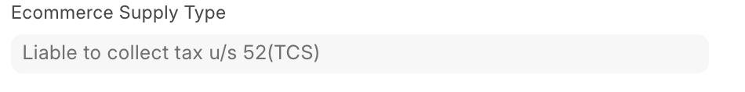
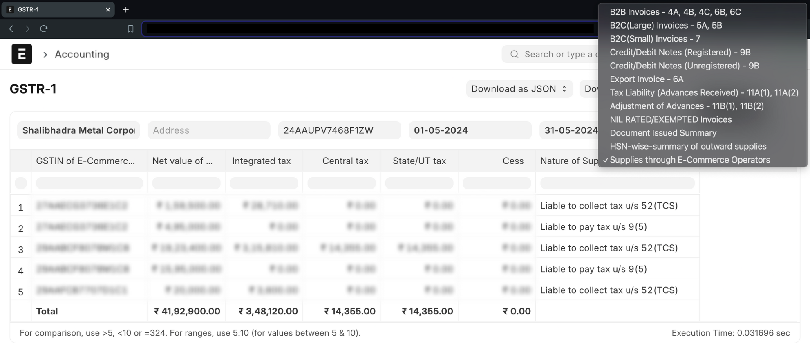

<PostDetail>

Under Secion-14 of GST, E-commerce Sales Transaction is further categorized into two sections.

- Liable to collect tax u/s 52(TCS)
- Liable to pay tax u/s 9(5)

---

### To perform E-commerce Sales Transaction through E-commerce operators follow the steps listed below: 

## First Step

First, you need to enable `Enable Sales through E-commerce Operators` in GST Seetings to perform E-commerce Sales Transaction via E-commerce operators.

## Creating Sales Invoice, Sales Order, Delivery Note

To perform E-commerce sales transactions, you need to create a Sales Invoice, Sales Order, or Delivery Note.

When creating documents for the above-mentioned doctypes, go to the GST Details section and enter the E-commerce GSTIN of your E-commerce operator. Depending on whether the transaction is subject to reverse charge or not, you will see the E-commerce Supply Type of your transaction.

.png) 

&nbsp;&nbsp;&nbsp;&nbsp;or

## Report GSTR-1

You can view all your E-commerce transaction under Section-14 of GST in the GSTR-1 report by settings appropriate filters.

You can also download Excel and JSON files to fill out your GSTR-1 returns.

## GSTR-3B

For invoices subject to reverse charge, the details in GSTR-3B will be found in `3.1.1 Supplies notified under section 9(5) of the CGST Act` in GSTR-3B return of GST portal.

For invoices not subject to reverse charge, the details in GSTR-3B will be in `3.1 Tax on outward and reverse charge inward supplies` in GSTR-3B return of GST portal. Inside this section, your transactions will be included where the Nature of Supplies is Outward taxable supplies.

</PostDetail>
