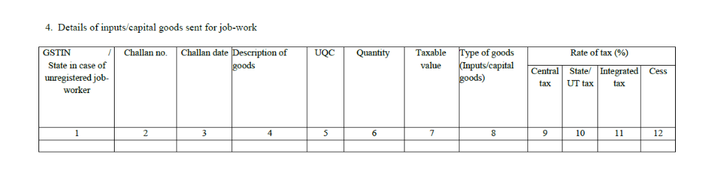
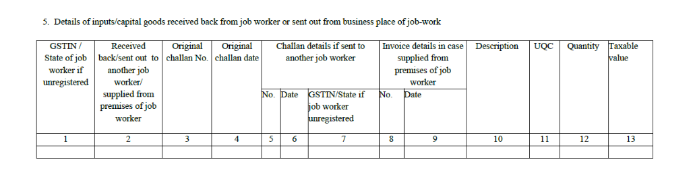

<PostDetail>

The complete guideline of how subcontracting works in ERPNext is provided
[here](https://docs.erpnext.com/docs/user/manual/en/subcontracting).

In this blog we will explore the various documents involved in the
subcontracting process and delve into different scenarios, offering a clear
understanding of its practical applications and workflows for Indian Compliance.

## What is Subcontracting ??

Subcontracting, or job work, allows businesses to send raw materials or semi-
finished goods to external vendors for further processing or assembly, enabling
efficient resource utilization. This approach helps companies focus on core
activities while leveraging external expertise to reduce production costs and
increase flexibility in scaling operations.

## ITC-04 Reporting for Subcontracting

Form GST ITC-04 must be submitted by the principal every quarter. He must
include the details of challans in respect of the following-

- Goods dispatched to a job worker or
- Received from a job worker or
- Sent from one job worker to another

### Details to be furnished in ITC-04

- **Goods sent to job worker (Table-4)**

Various details must be mentioned such as GSTIN, challan number, tax amount etc.
All details will be available from the challans.

- **Goods received back from the job worker (Table-5)**

The details of goods received back will be mentioned here. The goods may be
received by the principal or sent to another job worker directly from the first
job worker’s place of business. All details of original challans and new
challans must be mentioned.

Refer [here](https://docs.indiacompliance.app/docs/gst-reports/miscellaneous_reports#gst-job-work-stock-movement-report)
to learn how ITC-04 reporting is managed in ERPNext for Indian Compliance.

## Subcontracting Workflow

### Items

- **Service Item:** This item is used to record and charge the service cost
  associated with the job work process, reflecting the labor or services provided
  by the Job Worker.

- **Raw Materials/Capital Goods:** In subcontracting, Raw Materials are items
  that are provided to a subcontractor to be processed into a semi-finished or
  finished product. Whereas, Capital Goods are tangible assets that a company uses
  to produce goods and services, such as buildings, machinery, equipment,
  vehicles, and tools.

- **Finished Item:** This refers to the final product that is produced as a
  result of the job work process.

### Bill of Material

A Bill of Materials (BOM) is a comprehensive document that outlines all the raw
materials, components, and parts required to manufacture a product, along with
the precise quantities for each. It serves as a detailed blueprint for the
production process, ensuring accuracy and consistency in material planning and
assembly.

Let's consider a simple example, where you manufacture a pen. The processed pen
will be named under the Bill of Materials(BOM), whereas, the nib, plastic, ink,
etc. will be categorized as sub-items.

### Purchase Order

In the subcontracting workflow, the Purchase Order primarily documents the
service received from the job worker for the job work performed. It ensures
proper tracking of the subcontracted services and acts as a formal record of
the transaction.

### Subcontracting Order

A Subcontracting Order outlines the requirements for the finished goods to be
produced by the subcontractor after job work is performed. It details what will
be obtained from the subcontracting process, along with the specifications for
the raw materials used.

### Stock Entry

A Stock Entry tracks the transfer of goods from your warehouse to the supplier,
documenting the movement of inventory and ensuring accurate records of stock
levels throughout the process.

### Subcontracting Receipt

Subcontracting Receipt is used to receive items from your supplier. You must
specify the Supplier Warehouse from which the raw materials will be taken and
indicate the Accepted Warehouse where the finished goods will be received. This
process can be thought of as a backflush for subcontracting, streamlining
inventory management by automatically adjusting stock levels for both raw
materials and finished products.

Link the receipt with the **Stock Entries** and the **Subcontracting Returns**
in **Doc References** to maintain clear documentation of the transactions
associated with the receipt. This ensures that all relevant information required
for ITC-04 Reporting is accurately recorded and tracked.

Refer
[here](https://docs.indiacompliance.app/docs/ewaybill-and-einvoice/gst_settings#e-waybill-settings)
to learn how to enable e-Waybill generation for Subcontracting in ERPNext for
Indian Complaince.

## Subcontracting Scenarios

### Resend the Finished Good for Rework

When the finished goods are received back from the supplier and require some
rework, they must be sent back to the supplier for further processing. This
process can be effectively managed in ERPNext through Subcontract Returns, which
allows for the documentation and tracking of items being returned to the
subcontractor for additional modifications or adjustments.

- From the **Subcontracting Receipt**, generate **Subcontract Returns** for the
  finished goods that need to be sent to the supplier.
  This transaction will be included in Table-4 for ITC-04 Reporting.

- Create a stock entry return from the subcontracting order if any raw materials
  need to be sent back to the supplier along with the finished goods.
- Link the stock entry against which the stock entry return is made in the **Doc
  References** section of the stock entry return, which will be useful for
  Original Challan Reference that will be used in Table-4 for ITC-04 Reporting.

- Finally, receive the returned goods through the subcontracting receipt to
  complete the process cycle.
- Link the stock entries and subcontracting returns associated with the
  subcontracting receipt in the **Doc References**.
  This transaction will be included in Table-5 for ITC-04 Reporting.

### Multilevel Subcontracting Process

Multi-Level Subcontracting refers to a complex manufacturing process where
multiple subcontractors are involved in the production of a final product. In
this setup, primary subcontractors may outsource certain tasks to secondary
subcontractors, creating a layered supply chain.

For Example, a furniture manufacturer, **XYZ (Warehouse-X)**, produces unfinished
wooden chairs in-house and then outsources further processing. **Subcontractor-A
(Warehouse-A)** stains and finishes the chairs, while
**Subcontractor-B (Warehouse-B)** assembles the cushions.

Here's how the multi-level subcontracting process can be implemented in ERPNext:

- **Initial Subcontracting**: Company XYZ initiates the process by creating a
  Purchase Order and a Subcontracting Order for **Subcontractor-A**. A stock entry
  is generated to transfer raw materials from **Warehouse-X** to **Warehouse-A**.
  This transaction will be included in Table-4 for ITC-04 Reporting.

- **Completion by Subcontractor-A**: Upon completion of the job work,
  Subcontractor-A creates a Subcontracting Receipt for **Warehouse-A** to
  **Warehouse-A** to formally receive the first part of finished goods.
  This transaction will be included in Table-5 for ITC-04 Reporting.

- **Further Subcontracting**: Subcontractor-A then creates Purchase Order and
  Subcontracting Order for subcontracting by **Subcontractor-B**, along with a
  stock entry to transfer goods from **Warehouse-A** to **Warehouse-B**.
  This transaction will be included in Table-5 for ITC-04 Reporting.

- **Completion by Subcontractor-B**: After Subcontractor-B completes the work,
  **Company XYZ** creates a Subcontracting Receipt to receive goods from
  **Warehouse-B** to **Warehouse-X**.
  This transaction will be included in Table-5 for ITC-04 Reporting.

This process effectively completes the multi-level subcontracting workflow in
ERPNext

### Excess Raw Materials Return

When all raw materials sent to a job worker are not utilized, they need to be
returned. This process can be managed in ERPNext using Stock Entry Returns.

- The initial steps for sending goods to the subcontractor remains the same.

- A Stock Entry Return must be created to receive back the unused raw materials,
  and it should be linked to the original stock entry under Doc References which
  will be used as original challan in Table-5 for ITC-04 Reporting.

- Finally, receive the finished goods through the Subcontracting Receipt to
  complete the process cycle.This transaction will be included in Table-5 for
  ITC-04 Reporting.

::: info
There is a time limit for the principal manufacturer to receive goods:

- Capital Goods- 3 years from effective date
- Input Goods- 1 year from effective date

In case goods are not received within the period as mentioned above, such goods
will be deemed as supply from the effective date. The principal manufacturer
will have to pay tax on such deemed supply. The challan issued will be treated
as an invoice for such supply.
:::
</PostDetail>
