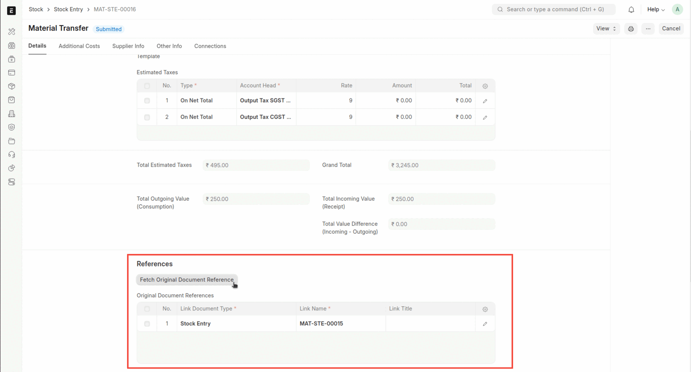
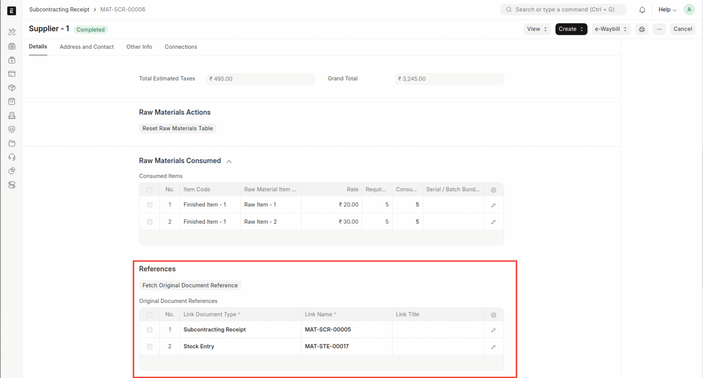

<PostDetail>

The complete guideline of how subcontracting works in ERPNext is provided [here](https://docs.erpnext.com/docs/user/manual/en/subcontracting).

In this blog we will explore the various documents involved in the subcontracting process and delve into different scenarios, offering a clear understanding of its practical applications and workflows.

## What is Subcontracting ??

Subcontracting, or job work, allows businesses to send raw materials or semi-finished goods to external vendors for further processing or assembly, enabling efficient resource utilization. This approach helps companies focus on core activities while leveraging external expertise to reduce production costs and increase flexibility in scaling operations.

## Subcontracting Workflow

### Items

- **Service Item:** This item is used to record and charge the service cost associated with the job work process, reflecting the labor or services provided by the Job Worker.

- **Raw Materials/Capital Goods:** In subcontracting, Raw Materials are items that are provided to a subcontractor to be processed into a semi-finished or finished product. Whereas, Capital Goods are tangible assets that a company uses to produce goods and services, such as buildings, machinery, equipment, vehicles, and tools. 

- **Finished Item:** This refers to the final product that is produced as a result of the job work process.

### Bill of Material

A Bill of Materials (BOM) is a comprehensive document that outlines all the raw materials, components, and parts required to manufacture a product, along with the precise quantities for each. It serves as a detailed blueprint for the production process, ensuring accuracy and consistency in material planning and assembly.

Let's consider a simple example, where you manufacture a pen. The processed pen will be named under the Bill of Materials(BOM), whereas, the nib, plastic, ink, etc. will be categorized as sub-items.

### Purchase Order

In the subcontracting workflow, the Purchase Order primarily documents the service received from the job worker for the job work performed. It ensures proper tracking of the subcontracted services and acts as a formal record of the transaction.

### Subcontracting Order

A Subcontracting Order outlines the requirements for the finished goods to be produced by the subcontractor after job work is performed. It details what will be obtained from the subcontracting process, along with the specifications for the raw materials used.

### Stock Entry

A Stock Entry tracks the transfer of goods from your warehouse to the supplier, documenting the movement of inventory and ensuring accurate records of stock levels throughout the process.

### Subcontracting Receipt

Subcontracting Receipt is used to receive items from your supplier. You must specify the Supplier Warehouse from which the raw materials will be taken and indicate the Accepted Warehouse where the finished goods will be received. This process can be thought of as a backflush for subcontracting, streamlining inventory management by automatically adjusting stock levels for both raw materials and finished products.

Link the receipt with the **Stock Entries** and the **Subcontracting Returns** in **Doc References** to maintain clear documentation of the transactions associated with the receipt. This ensures that all relevant movements of goods are tracked accurately within the system.

### Purchase Receipt

It is used to formally receive the services performed on raw materials by the job worker, resulting in the production of finished items.

## Subcontracting Scenarios

### Resend the Finished Good for Rework

When the finished goods are received back from the supplier and require some rework, they must be sent back to the supplier for further processing. This process can be effectively managed in ERPNext through Subcontract Returns, which allows for the documentation and tracking of items being returned to the subcontractor for additional modifications or adjustments.

- From the **Subcontracting Receipt**, generate **Subcontract Returns** for the finished goods that need to be sent back to the supplier.

- Create a stock entry return from the subcontracting order if any raw materials need to be sent back to the supplier along with the finished goods.
- Link the stock entry against which the stock entry return is made in the **Doc References** section of the stock entry return. This provides a clear connection between the original stock entry and the return, facilitating better tracking and accountability of inventory movements.

- Finally, receive the returned goods through the subcontracting receipt to complete the process cycle.
- Link the stock entries and subcontracting returns associated with the subcontracting receipt in the **Doc References**.

### Multilevel Subcontracting Process

Multi-Level Subcontracting refers to a complex manufacturing process where multiple subcontractors are involved in the production of a final product. In this setup, primary subcontractors may outsource certain tasks to secondary subcontractors, creating a layered supply chain.

For Example, a furniture manufacturer, XYZ, produces unfinished wooden chairs in-house and then outsources further processing. Subcontractor-A stains and finishes the chairs, while Subcontractor-B assembles the cushions.

Here's how the multi-level subcontracting process can be implemented in ERPNext:

- **Initial Subcontracting**: Company XYZ initiates the process by creating a Purchase Order and a Subcontracting Order for **Subcontractor-A**. A stock entry is generated to transfer raw materials from XYZ to **Subcontractor-A**.

- **Completion by Subcontractor-A**: Upon completion of the job work, **Subcontractor-A** creates a Subcontracting Receipt to **themselves** to formally receive the finished goods.

- **Further Subcontracting**: Subcontractor-A then creates Purchase Order and Subcontracting Order for subcontracting by **Subcontractor-B**, along with a stock entry to send materials to Subcontractor-B.

- **Completion by Subcontractor-B**: After Subcontractor-B completes the work, **Company XYZ** creates a Subcontracting Receipt to receive goods from **Subcontractor-B**.

This process effectively completes the multi-level subcontracting workflow in ERPNext

</PostDetail>
