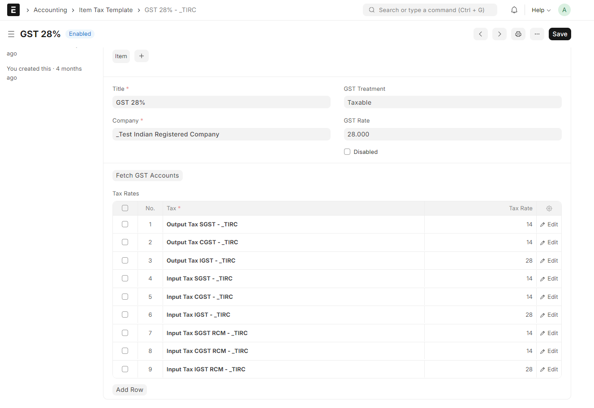
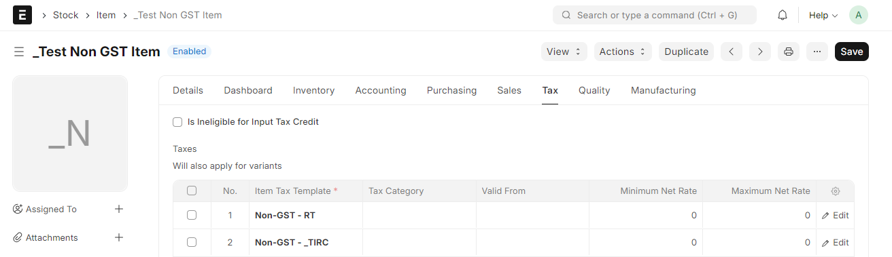
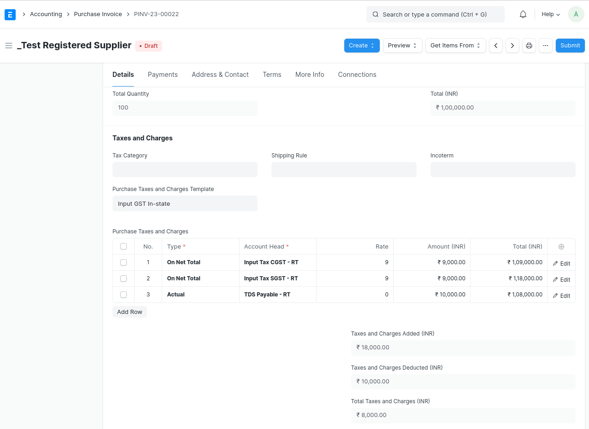
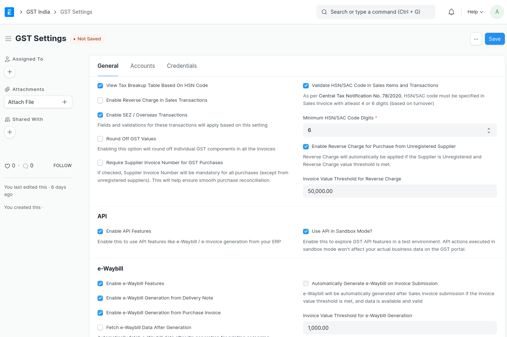

# Configuring GST in ERPNext

As of 2017, India will fall under the new GST (Goods and Services Tax) regime and India Compliance makes it easy for users to track the details of its Supplier and Customers across Invoices and make the required reports.

**Following Points to be considered for GST Setup in ERPNext.**

- ## HSN Codes

According to the GST Law, your itemised invoices must contain the HSN Code related to that Item. India Compliance comes pre-installed with all 12,000+ HSN Codes so that you can easily select the relevant HSN Code in your Item.

- ## Tax Accounts

With new installations, you get default GST Accounts created for your company.

- ## Tax Templates

Default Sales and Purchase Tax Templates are pre-configured for your company.

- ## Item Tax Templates

For different tax rates, you get item tax templates preconfigured for your company. These are useful where you wish to have different item tax rates configured other than the ones configured in default Sales and Purchase Tax Templates.

- ## Item Master

Nil rated, exempted or Non-GST items have Is nill rated or Is Non-GST checkbox is checked in the item master.

- ## GST Accounts

Where GST Accounts are auto-created, their settings are automatically updated for your company in GST Settings. This will ensure GST Validations and appropriate GST Reports.

> Where you wish to have different default settings, you must configure them manually at all the above places.

**GST Accounts form a very important part of GST Settings. Many validations and calculations are based on these settings.**

- You should have 3 rows for each company in GST Accounts one for each Input, Output and Reverse Charge Accounts.

- Specify individual CGST / SGST / IGST / Cess Accounts as created and applicable to you.

- Correct usage of accounts and taxes is validated based on these settings. Also important calculations like taxable value or ITC Availability are calculated based on these settings.

::: warning
 It is important to note that multiple GST accounts are not recommended and allowed for simplicity. You can maintain only one GST Account for multiple tax rates or even for Multi-GSTIN setup for your company. Further Analysis and breakup is easy to establish from the transactions without the need of maintaining multiple accounts, and hence this simplicity.
 :::

## Update Company and Masters

GST Law requires that you maintain the GSTIN details for all your customers and suppliers. In India Compliance, GSTIN is linked to both **Address** and **Parties**.

- ### Update GSTIN Information for your Company

Update the GST Details to the company. GST Validations will apply to all transactions for your company based on the GST Category set for your company.

Also, create or update your Company Address with appropriate GST Details.

- ### Create/Update Customers and suppliers

In a very similar manner create or update your customers and suppliers with GSTIN Details. Also, they need to be updated in relevant addresses of the parties.Since GST is a destination-based tax, please make sure all Indian Customers and Suppliers have GST state (even the Unregistered ones).

GST will be applied and validated to a specific transaction based on this master. GST Details will be first fetched from the Address. If the Address is not available in a transaction, it will be applied as per the Customer or Supplier.

- ### Taxes Configuration for Supplier

In case of a supplier, if reverse charge is applicable for the supplier, you must check the checkbox for Reverse Charge Applicable. This will ensure that reverse charge is applied to all the transactions with this supplier. Also, you get an option to specify GST Transporter ID for the supplier. This will be fetched when you select the transporter and used in e-Waybill Generation.

- ### Tax Withholding Category for Customer/Supplier

In scenarios where tax withholding is mandated for suppliers, it becomes imperative to accurately select the appropriate Tax Withholding Category. This will ensure that tax withholding is consistently applied to all the transactions involving the designated supplier. Similarly, in cases where TCS is applicable, the Tax Withholding Category must be chosen for the customer. Note that tax rate in tax witholding category can be negative if required for GST TDS in Sales Invoice. All accounts that are used in tax-whitholding categories will be ignored for the purposes of calculating taxable value for GST.

## General Settings

- **View Tax Breakup Table Based On HSN Code**  
    Tax Breakup Table in Sales Invoice or Purchase Invoice is generally available item-wise. If this is enabled, the tax breakup table shall be HSN Wise.

    

- **Enable Reverse Charge in Sales Transactions**
    Enable this setting, if reverse charge is applicable on goods/services you sell.

- **Enable SEZ/Overseas Transactions**
    Enable this option if you engage in Import/Export transactions with SEZ/Overseas Entities. A certain fields or validations are simplified if its not applicable to you.

- **Round Off GST Values**  
    Enabling this option will round off individual GST components in all the invoices.

- **Require Supplier Invoice Number for GST Purchases**
    By enabling this option, the Supplier Invoice Number will become mandatory for all purchases (except from unregistered suppliers). This enhancement will contribute to seamless purchase reconciliation processes.

- **Validate HSN Code in Sales Item and Transactions**  
    Enable this setting to make HSN/SAC mandatory for selling items. As per Central Tax Notification No. 78/2020, HSN/SAC code must be specified in Sales Invoice with minimum of 4 or 6 digits (based on turnover).

- **Minimum HSN/SAC Code Digits**
    Validation for minimum HSN/SAC code digits can be set here based on your turnover.

- **Enable Reverse Charge for Purchase from Unregistered Supplier**
    Enable this option if you are making purchases from an unregistered supplier, and reverse charge is applicable. This will automatically apply and enforce reverse charge on purchase transactions from unregistered suppliers.

- **Invoice Value Threshold for Reverse Charge**
    Reverse charge will be applicable only when the invoice value exceeds the specified threshold for purchases from Unregistered Suppliers.

    
