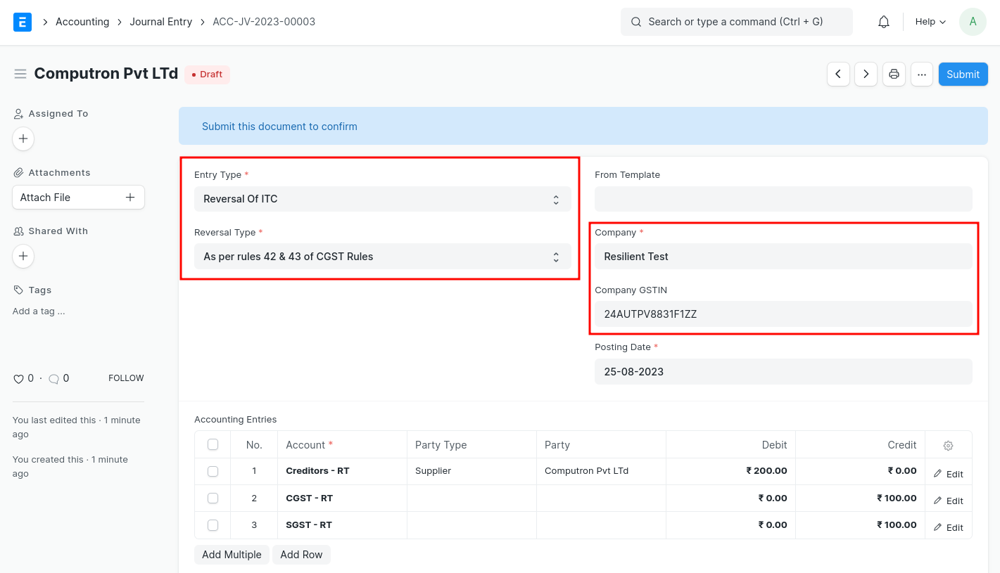
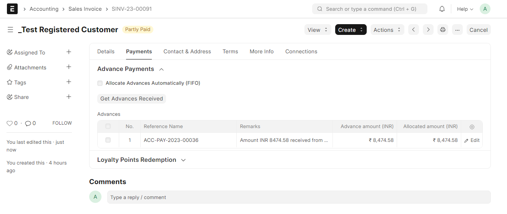
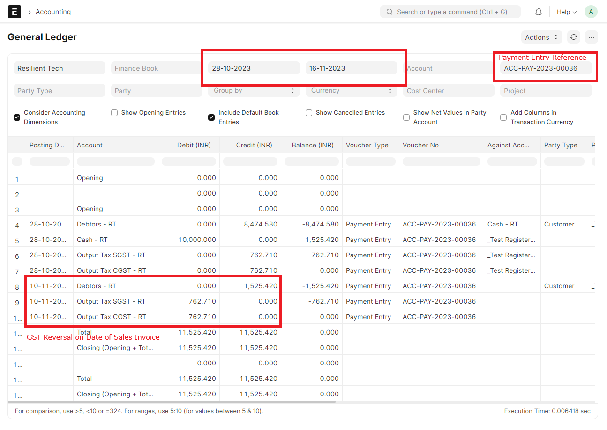
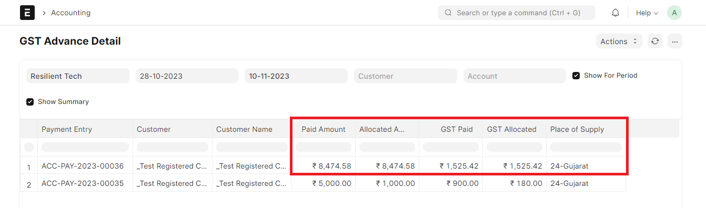
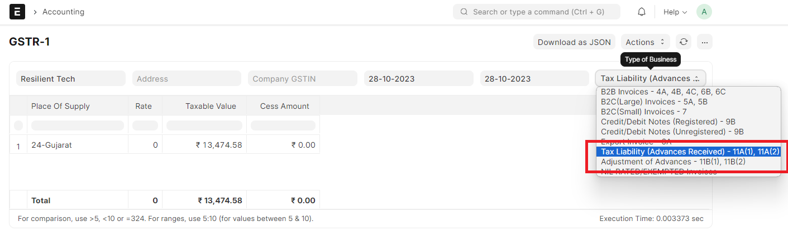

# Other GST Transactions

## Reversal of Input Tax Credit

To book reversal of ITC go to Journal Entry doctype and follow the following steps

1. Select "Entry Type" as "Reversal Of ITC"
2. In "Reversal Type" select "As per rules 42 &amp; 43 of CGST Rules" or "Others" based on the types of reversal
3. Select appropriate Company Address (GSTIN) for which ITC is being reversed
4. Fill the accounts and amounts in the Accounting Entries as shown below
5. Save and Submit

## GST on Advanced Payments

As per GST laws in India, where advances are received from a customer, there is a liability to pay GST on such advance receipts. This liability is then adjusted when the advance is adjusted against the supply made. Following example will help understand how this transaction will work with India Compliance.

### Advance Payment Receipt

Resilient Tech receives a payment of Rs. 10000/- from a customer. Resilient Tech is expecting to charge GST @ 18% in relation to the planned supply.

Advance payment received will be considered as amount received including GST. Resilient Tech is therefore liable to pay GST of Rs. 1525.42/- on this advance receipt.

### Supply of Services

One month later, Resilient Tech supplies services worth Rs. 20000/- + GST to the customer. Advance Payment received above is adjusted against the supply of services.

### Reversal of GST on Advance Payment

Automatic reversal of GST on Advance Payment will be posted against Payment Entry on the date of Supply of Services.

### GST Advance Detail Report

This report comes with following configurations:

**Period vs As on the Date Report**
- *Show for Period*: It would show **all** the transactions for the selected period.
- *As on the Date Report*: It would show **only** the transactions where GST unallocated amount is greater than 0.

**Detailed vs Summary Report**
- *Detailed Report*: It would even show invoice level details where GST is allocated.
- *Summary Report*: It would summarize GST allocation against each Payment Entry.

### GSTR-1 Report

