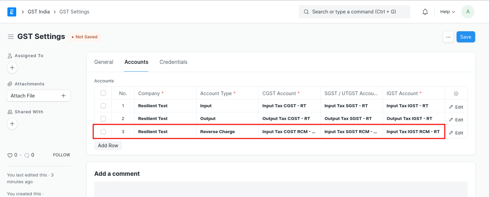
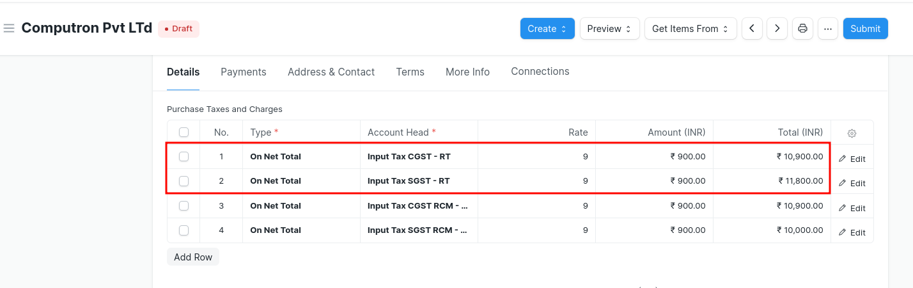
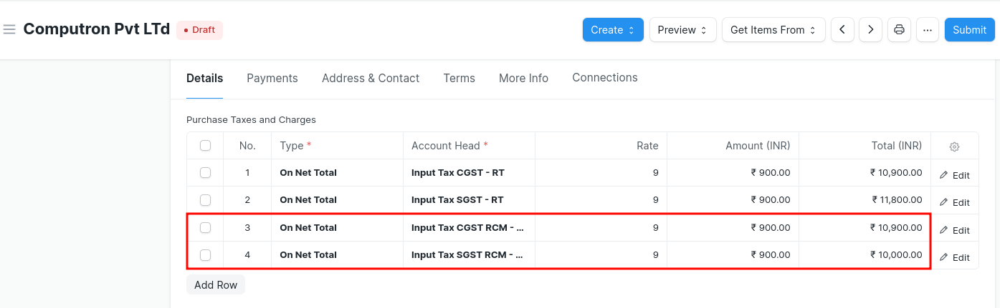
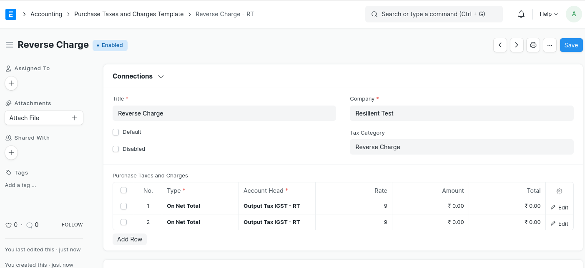

# Other GST Transactions

## Reversal of Input Tax Credit

To book reversal of ITC go to Journal Entry doctype and follow the following steps

1. Select "Entry Type" as "Reversal Of ITC"
2. In "Reversal Type" select "As per rules 42 &amp; 43 of CGST Rules" or "Others" based on the types of reversal
3. Select appropriate Company Address (GSTIN) for which ITC is being reversed
4. Fill the accounts and amounts in the Accounting Entries as shown below
5. Save and Submit

## Reverse Charge
Setting up reverse charge and posting reverse charge purchase invoices

- ### Add reverse charge accounts in GST Settings

Add reverse charge accounts for GST as shown in the image below and check the "Is Reverse Charge Account" as shown in the image below. Instead of separate reverse charge account the Output GST tax account used for sales can also be marked as reverse charge account

- ### Making purchase invoices liable to reverse charge

To make purchase invoices liable to reverse charge invoices please follow the following steps

* Select Supplier and add items to the invoice as usual

* Select "Reverse Charge Applicable as "Y" under GST Details Section
* If GST paid is eligible for input tax credit, in "Eligibility for ITC" select "ITC on Reverse Charge"
* "Add" taxes using the regular Input Tax account heads

* "Deduct" the same amount of taxes using the reverse charge accounts so that the net GST payable by the supplier is 0

* Save and Submit

In order to avoid manual selection of accounts and automate this process please follow below steps

* Create Tax Category for reverse charge

* Update tax category in the relevant supplier masters

* Create Purchase Taxes and Charges template for reverse charge

* Once this configuration is done, on selection of supplier appropriate Purchase Taxes and Charges Template will be applied
