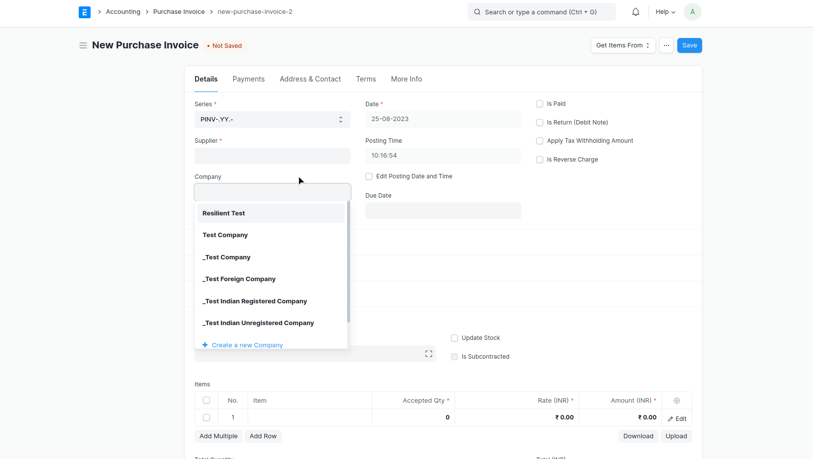
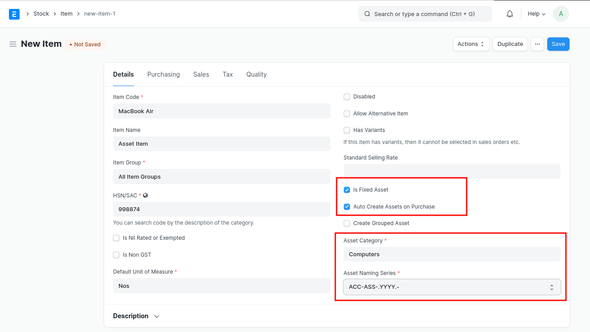

# GST Purchase Transactions
GST Purchase Transactions involves the aquisition of goods or services by a business from the supplier. Setup GSTIN of your supplier and the required Tax Templates to the transactions for making GST Ready Invoices!

## Purchase Invoice
1. Select the Supplier and Item.
2. Add Supplier Invoice Number and Supplier Invoice Date.(optional)
2. Check if the GSTIN of your Company and Supplier have been correctly set.
3. Check if the HSN Number has been set correctly in the Item.
4. Select  **In State GST** or **Out of State GST** as a tax template.
5. Save and Submit the Invoice.

## GST Asset Purchase
For purchasing a new asset:
1. Create an Asset Category.
2. Create a related Item with 'Is Fixed Asset' enabled and Asset Category for the item.
3. You can also enable the option 'Auto create Asset on Purchase' to create assets automatically.(Optional)

4. Then, Follow a Purchase Cycle (Purchase Order, Purchase Invoice and Purchase Receipt etc.) for purchasing an asset.
5. Enter the Asset Location in Items table of the Purchase Receipt or Purchase Invoice through which you are receving the item.
6. On submission of Purchase Receipt, based on the auto creatio n checkbox, Asset will be created automatically.

## GST Expense 
