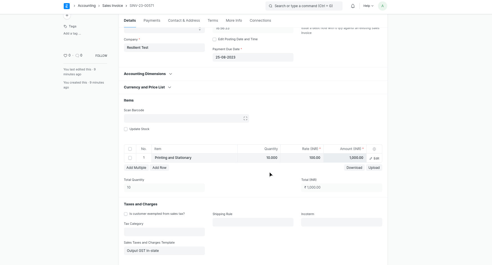
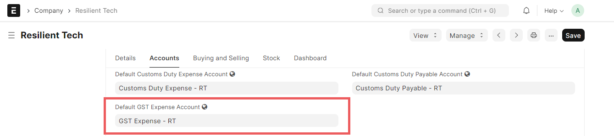
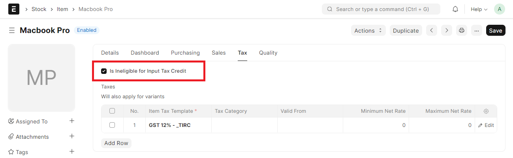
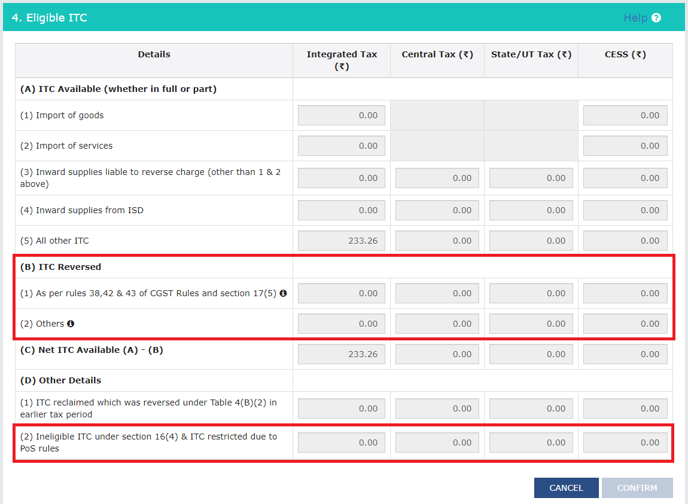
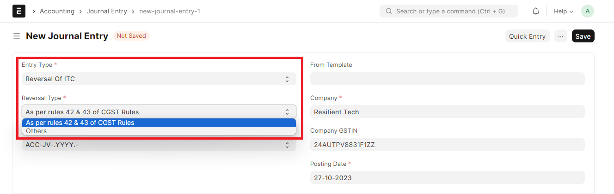
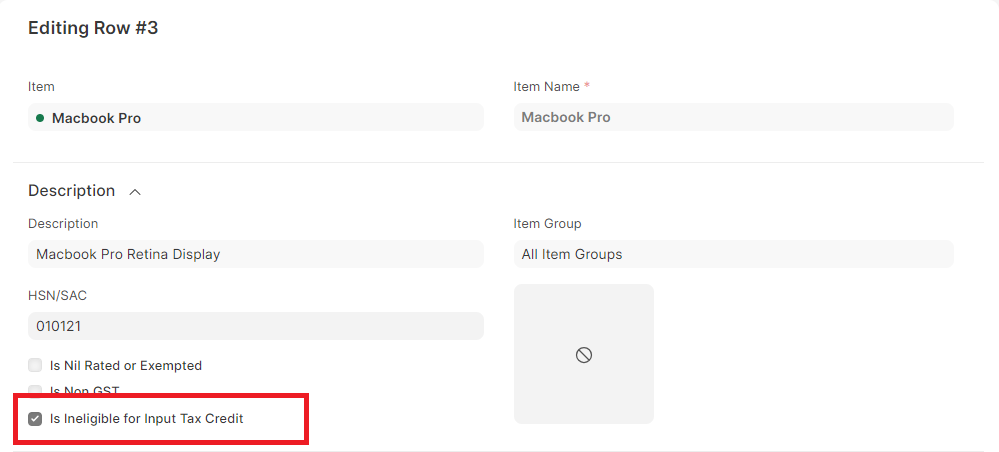
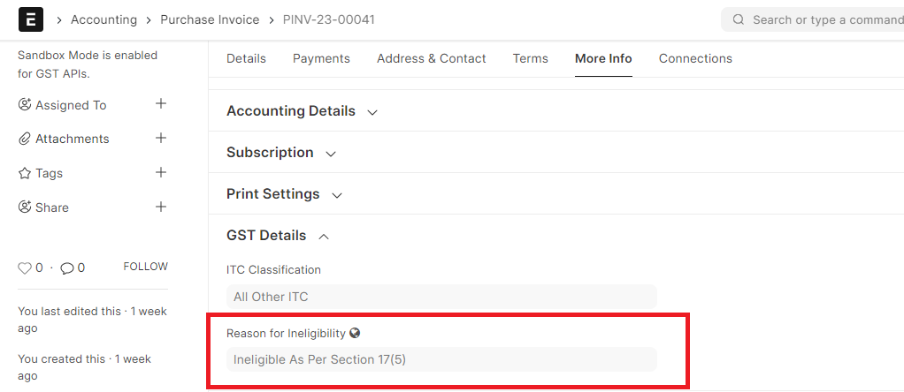
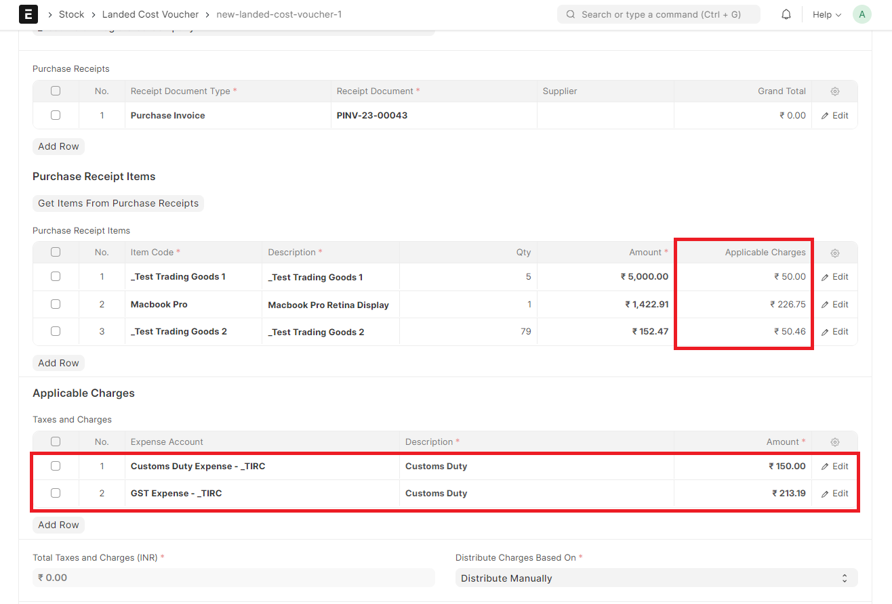
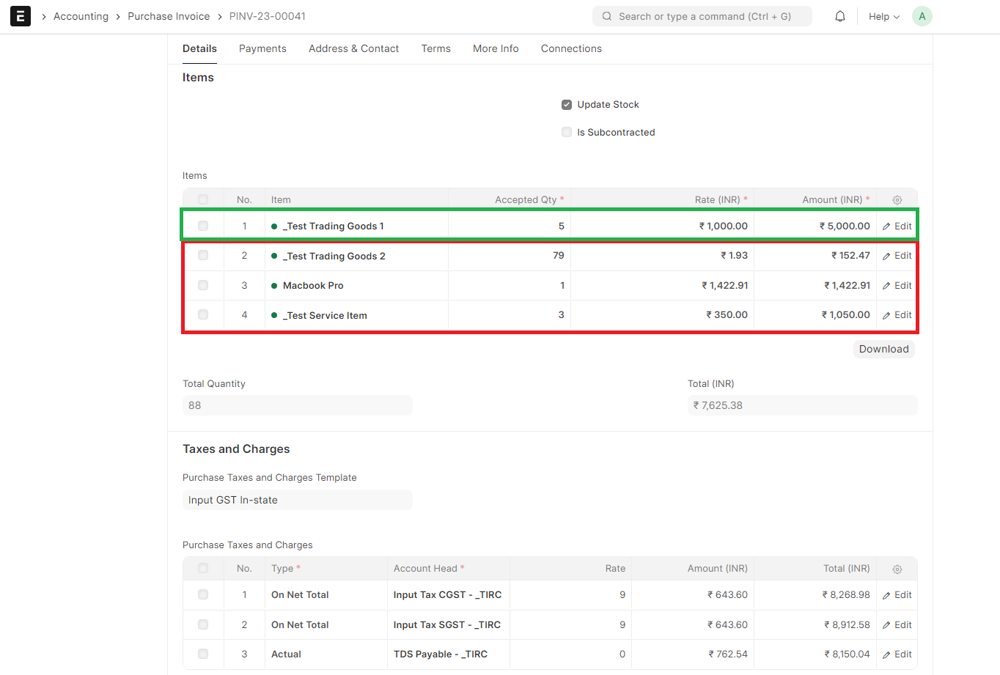
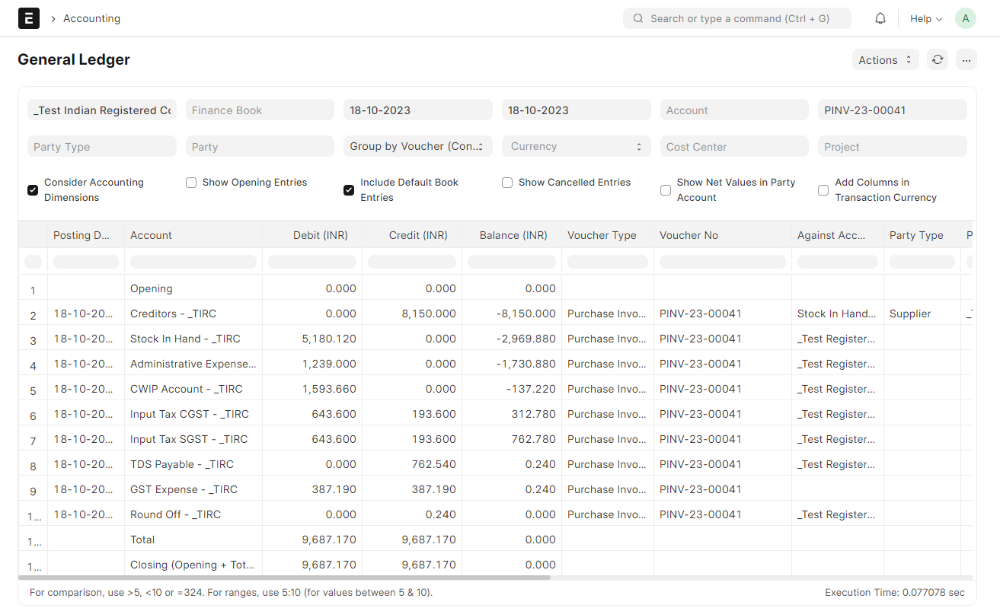

# GST Purchase Transactions
GST Purchase Transactions involves the aquisition of goods or services by a business from the supplier. Setup GSTIN of your supplier and the required Tax Templates to the transactions for making GST Ready Invoices!

## Purchase Invoice
1. Select the Supplier and Item.
2. Add Supplier Invoice Number and Supplier Invoice Date.(optional)
2. Check if the GSTIN of your Company and Supplier have been correctly set.
3. Check if the HSN Number has been set correctly in the Item.
4. Select  **In State GST** or **Out of State GST** as a tax template.
5. Save and Submit the Invoice.

## GST Asset Purchase
For purchasing a new asset:
1. Create an Asset Category.
2. Create a related Item with 'Is Fixed Asset' enabled and Asset Category for the item.
3. You can also enable the option 'Auto create Asset on Purchase' to create assets automatically.(Optional)

4. Then, Follow a Purchase Cycle (Purchase Order, Purchase Invoice and Purchase Receipt etc.) for purchasing an asset.
5. Enter the Asset Location in Items table of the Purchase Receipt or Purchase Invoice through which you are receving the item.
6. On submission of Purchase Receipt, based on the auto creatio n checkbox, Asset will be created automatically.

## GST Expense 
A business may incur day-to-day expenses such as rent, telephone bills, Internet Bill, stationery, petty-cash expenses, and so on, to carry out the operations. These expenses attract GST.

If you are a registered dealer and purchasing from another registered dealer, and paid GST at the time of payment or purchase, you are eligible to claim the Input Tax Credit.

To create a GST Expense Purchase Invoice:

1. Create a Item for the Expense.
2. Create a Purchase Invoice for the Expense.
3. Select the correct Expense Account in the Item.

## Reverse Charge
Setting up reverse charge and posting reverse charge purchase invoices.

- ### Add reverse charge accounts in GST Settings

Add reverse charge accounts for GST as shown in the image below and select the Account Type as "Reverse Charge" as shown in the image below. Instead of separate reverse charge account the Output GST tax account used for sales can also be marked as reverse charge account

- ### Making purchase invoices liable to reverse charge

To make purchase invoices liable to reverse charge invoices, follow the steps:

* Select Supplier and add items to the invoice as usual
* Enable "Is Reverse Charge" in Purchase Invoice
* If GST paid is eligible for input tax credit, in "Eligibility for ITC" select "ITC on Reverse Charge"
* "Add" taxes using the regular Input Tax account heads

* "Deduct" the same amount of taxes using the reverse charge accounts so that the net GST payable by the supplier is 0

* Save and Submit

In order to avoid manual selection of accounts and automate this process you can select already generated default Tax Template for Reverse Charge In-State as well Out-State Or to create your own please follow the below steps:

* Create Tax Category for reverse charge

* Update tax category in the relevant supplier masters

* Create Purchase Taxes and Charges template for reverse charge

* Once this configuration is done, on selection of supplier appropriate Purchase Taxes and Charges Template will be applied

## ITC Ineligibility

> Introduced in v14.18.0

A new feature was recently introduced in version-14 that automates ITC Reversal with GL Entry if you are not eligible to claim input tax credit.

### Configurations

* GST Expense Account should be set in company doctype

* If ITC is not eligible for specific items, enable Is Ineligible for ITC in Item Taxes.

### What are the cases where ITC is ineligible? How are these cases handeled in India Compliance?

**GSTR3B Extract**

As per laws in India, ITC may be required to be *reversed* in the following cases:
- *Rules 38, 42, and 43 of CGST*: This is usually in relation to sales made (eg: Input claims for Exempt sales). Such reversals can be handeled in Journal Entry. This will be reported in 4B(1) of GSTR-3B.

- *Section 17(5) of CGST*: This is usually in relation to item purchased. Such reversals if it's defined for item, can be handeled in Purchase Invoice automatically. For other cases (like personal use) it can be handeled in Journal Entry. This will be reported in 4B(1) of GSTR-3B.

- *Other reasons*: Reversal can be handeled in Journal Entry. This will be reported in 4B(2) of GSTR-3B.

- *ITC is restricted due to PoS (Place of Supply) rules*. As per these rules, ITC can only be claimed if Place of Supply is same as State of Registration of the supplier.
	eg: If place of supply is Maharashtra, then ITC cannot be claimed if company is registered in Karnataka. Classic example: You booked a stay in Mumbai, but your company is registered in Karnataka. 

	Such cases are automatically handeled in Purchase Invoice and ITC in such cases is reversed if claimed. This will then be reported in 4D(2) of GSTR-3B. 

	> Note: This will be handeled irrespective of ITC eligibility set in Item.

**Journal Entry**

**Purchase Invoice Item**

**Purchase Invoice** (Reason Autoset)

### Which accounts are affected in case of ITC Reversal done automatically?

Accounts affected will depend on item.
- Expense items: Expense account will be debited proportionally.
- Stock items: Stock account will be debited proportionally and its value will be adjusted.
- Asset items: Asset account will be debited proportionally and its value will be adjusted.

Different workflows are taken care of and accounting would be done accordingly.
- Purchase Receipt --> Purchase Invoice: Item valuation is adjusted in Purchase Receipt. Input Reversal is done in Purchase Invoice.
- Only Purchase Invoice: Item valuation is adjusted in Purchase Invoice. Input Reversal is done in Purchase Invoice.
- Purchase Receipt --> Purchase Invoice --> Bill of Entry: Input Reversal is done in Bill of Entry. 
	
	Taxes are not known in purchase receipt / purchase invoice. Hence valutaion is **not** automatically updated for purchase receipt / purchase invoice. However, proportionate valuation is auto-populated when trying to create Landed Cost Voucher from Bill of Entry.

**Landed Cost Voucher**

### Example use case with Purchase Invoice

**Purchase Invoice with Stock / Expense / Asset Item** (Items in Green are eligible for ITC)

**GL Entry**

