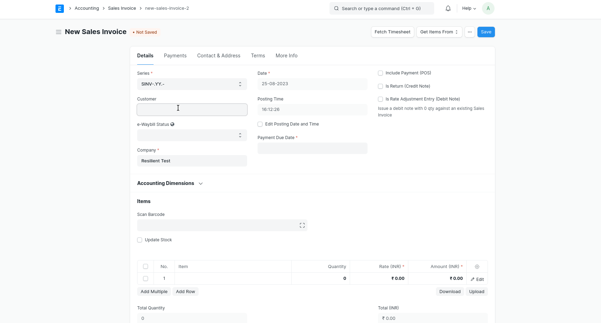
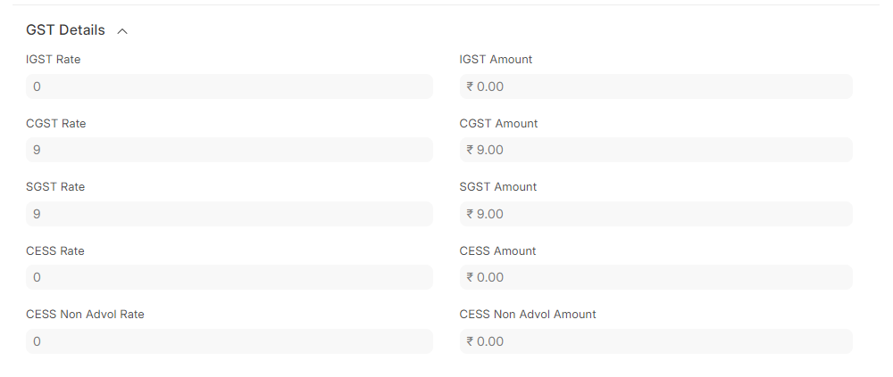

# Making GST Transactions
If you have set up the GSTIN of your Customers and Suppliers, and your tax template, you are ready to go for making GST Ready Invoices!

## Sales Invoice
1. Select the Customer and Item.
2. Check if the GSTIN of your Company and Customer have been correctly set.
3. Check if the HSN Number has been set correctly in the Item.
4. Select  **In State GST** or **Out of State GST** as a tax template.
5. Save and Submit the Invoice.

### Printing GST Tax Invoice  
To print Tax Invoices as per GST guidelines, please select **GST Tax Invoice** print format. This print format includes company address, GSTIN numbers, HSN/SAC Code and item-wise tax breakup. While printing, select the correct value of the `Invoice Copy` field to mention whether it is for the Customer, Supplier or Transporter.

## GST Details
Item tax breakup for each item is shown in the GST Details section for the Item table. This ensures better performance, better print formats, and backwards compatibility for changes to GST Accounts.

