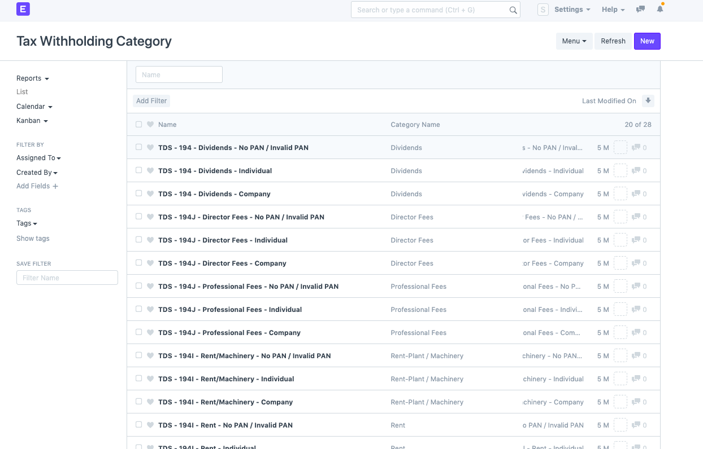
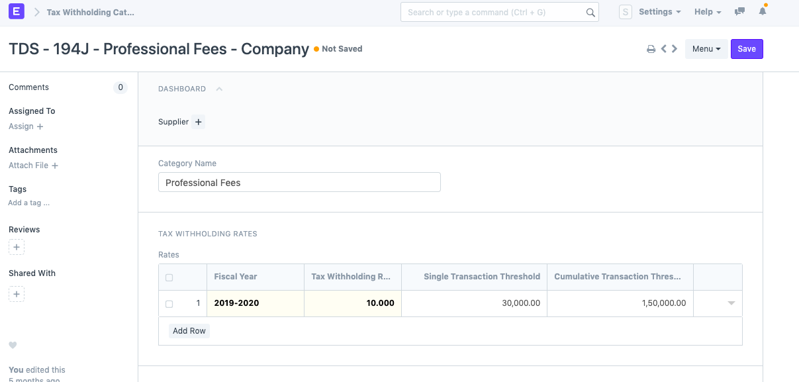
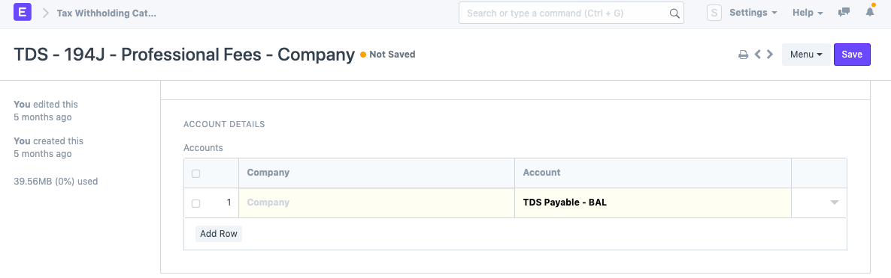
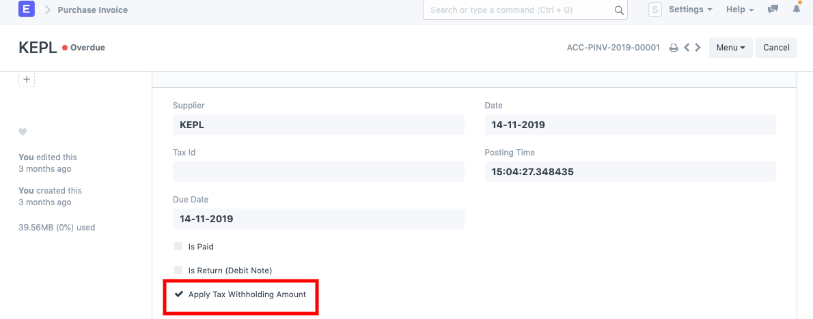

# TDS Configuration

To set up *TDS* in ERPNext follow the below steps:

- First, you have to define Tax withholding categories, by default 28 categories are already pre-defined as per Indian statutory compliances. But if you want to add a new category then you can create the same by clicking on "New"(button at right top corner)

- As per category you have to define the Tax withholding rate along with "Single Transaction Threshold" & "Cumulative Transaction Threshold" for the Financial/Fiscal year.

- On the same screen you will find another section of "Account Detail" to set company-wise TDS Payable account.

- Once you are done with the Tax withholding setup go to Supplier master and assign the Tax withholding category.

- Now when you create a Purchase invoice against that supplier make sure the "Apply Tax withholding Amount" is checked then only the system will auto fetch TDS Payable amount in the "Taxes & Charges" table based on the Threshold you have defined.

The standard report is also available to check monthly payable, just search for the "TDS payable monthly" report for the same.