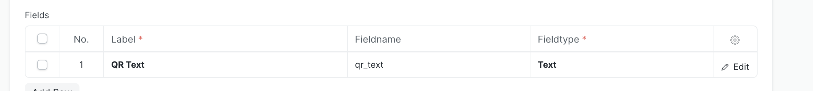
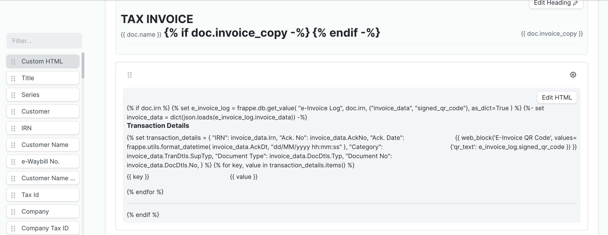

# Guide to Add e-Invoice QR Code in Print Formats

This guide provides instructions on how to add an e-Invoice QR code to print formats. It covers both custom print formats and standard print formats.

## Custom Print Format

To add a QR code to a custom print format, use the following code snippet:

```








```

::: tip
You  can also check out the implementation in the [Standard e-Invoice print format](https://github.com/resilient-tech/india-compliance/blob/4bd775ab656f81fc6764cc1dc6587d11e0097afd/india_compliance/gst_india/print_format/e_invoice/e_invoice.html#L109) for further guidance.
:::

## Standard Print Format

To add an e-Invoice QR code to a standard print format, follow these steps:

##### 1. Create a Web Template for the QR Code

- Open the Web Template List using the awesome bar and add a new Web Template.
- Enter the name of the Web Template as "e-Invoice QR Code"
- Select Type as "Component"
- Select Module as "Printing"
- Copy the following code snippet into the template field:

```

```

##### 2. Add the following fileds in child table "Fields"

- Label: QR Text
- Fieldname: qr_text
- Field Type: Text



##### 3. Adding the fields in print format

- Go to the print format where you want to add the QR Code. and click on `Edit Format`.
- Add a custom HTML section.
- Insert the following code snippet into the custom HTML section:

```







 {{ web_block('e-Invoice QR Code', values={'qr_text': e_invoice_log.signed_qr_code }) }}



```



::: warning
Make sure the name mentioned in `web_block` exactly matches the name of your Web Template.
:::
