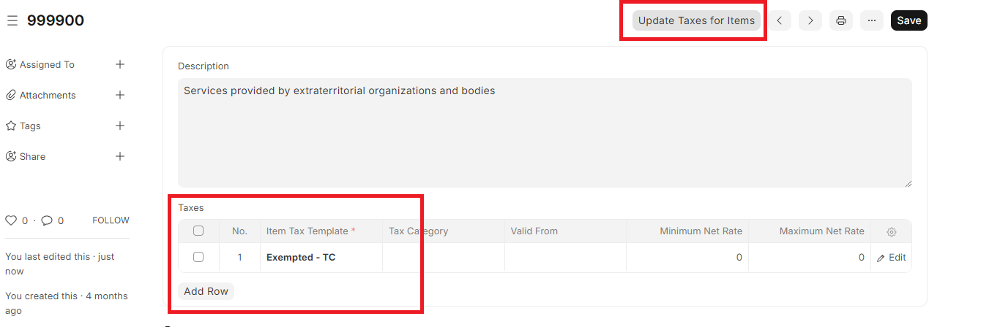

# Migration Guide

## Item Tax Templates

> Applicable from v14.21.0 and v15.2.0

Item Tax Templates have been enhanced to have a wider scope.

### Changes

Following breaking change is introduced to simplify setup, reduce errors, and better visibility in transactions.

- Introduced <strong>GST Details</strong> in all transactions. [Learn more](../configuration/sales_transaction.md#gst-details)
- Fields <strong>Depricated</strong> from Item; `Is Nil Exempt` and `Is Non-GST`. Instead `GST Treatement` is introduced in Item Tax Templates. [Learn More](../configuration/gst_setup.md#item-tax-templates)
- Splitting of `Is Nil Exempt` to `Nil-Rated` and `Exepted`
- <strong>Patch</strong>: Items marked as `Is Nil Exempt` will be marked as `Nil-Rated` in Item Tax Templates. If this is not acceptable for a few items, you should manually update your configuration as required.

<strong>Best approach to manually update:</strong>
Update HSN Taxes >> Update taxes for Items >> This will update item tax templates for your items.

