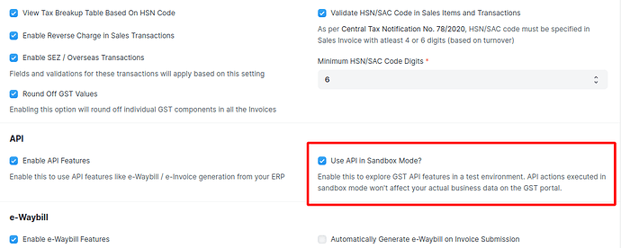

# Sandbox for India Compliance

## How to set up sandbox?

Sandbox comes pre-configured with credentials. Sandbox can be enabled from your site configuration as below.

- Enable `Use API in Sandbox Mode?` from GST Settings.

- You must be logged in to your India Compliance Account to use the sandbox. However, any use of API calls for sandbox will not be billed.

::: info

`ic_api_sandbox_mode`config is now deprecated and setting this config will no longer have any effect.
Your existing settings in site_config.json will be ported to the new API section in GST Settings.

:::

## Sandbox for e-Waybill

A lot of functionality has been developed around e-Waybill, and you may test it out in the Sandbox mode as you like with the following restrictions (for sandbox only):

- Although the distance is auto-populated for live APIs, it's not the same for the sandbox. So you may need to give a dummy distance between 1 to 4000 km.
- Use `05AAACG2140A1ZL` as transporter GSTIN if required.
- You can use all other functionality, including print, attach, update, extend or cancel to test the APIs.

## Sandbox for e-Invoice

You can test e-Invoice and its interaction with e-Waybill with the following restrictions (for sandbox only):

- You shall not be able to print or attach an e-Waybill print. This is not possible as APIs are different with different user credentials.
- You will not be able to update the transporter or vehicle information from the sandbox.
- Other than this, you can test the generation or cancellation of e-Invoice & e-Waybills.

## Sandbox for Public APIs

Please note that Public APIs are not supported in the sandbox mode.
