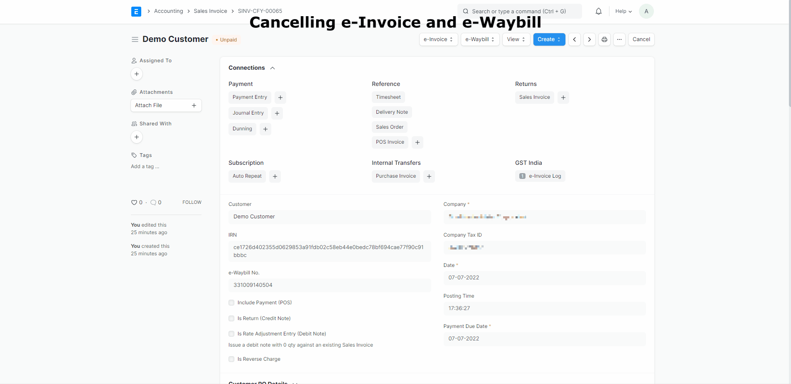

# e-Invoice

e-Invoice is an electronic invoice required to be generated on [e-Invoice Portal](https://einvoice1.gst.gov.in/) for all invoices except for supplies made to unregistered customers. In order to comply with the same, India Compliance offers easy, quick and reliable solution to generate e-Invoice.

## Prerequisites
- [GSP credentials in ERPNext](gst_settings#gsp-credentials)
- [India Compliance Account](../getting-started/india_compliance_account#account-creation)
- API should be enabled under GST Settings.
- [e-Invoice Configration](gst_settings#e-invoice-settings) 

## Generating e-Invoice

e-Invoice would be generated automatically on submission of Invoice if its applicable to you.After the generation IRN will be updated on invoice and QR will be generated.

### Manual Trigger

In case you would like to manually trigger the generation, you can do so after submission of Invoice. e-invoice menu options will come up. Once you click on Generate button, e-Invoice generation will be triggered.

## Cancelling e-Invoice

You can cancel e-Invoice from the e-Invoice menu options if its within the validity period.

**Click on e-Invoice menu --> Click Cancel button --> Give reasons for cancellation in the dialog --> and confirm to cancel the e-Invoice.**

