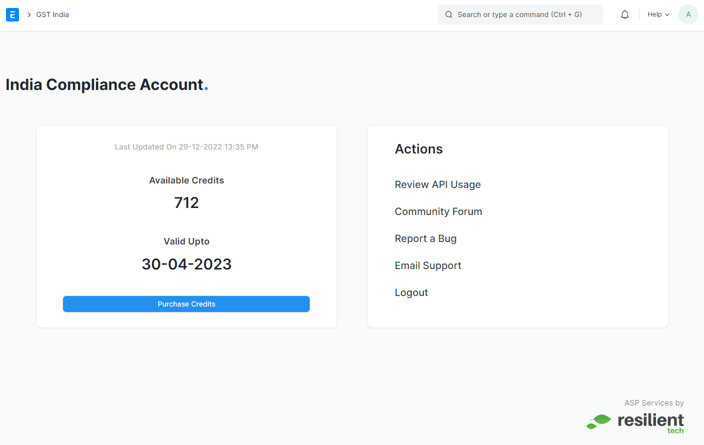

# India Compliance Account

Want to test the API features?  
Get started in less than a minute with all API Features and test out the app.

::: tip Bundled on Frappe Cloud
We recommend [Frappe Cloud](https://frappecloud.com/dashboard/signup?referrer=99df7a8f) for hosting your site. It comes bundled with India Compliance API features and hence India Compliance Account won't be accessible there.
:::

## Account Creation
To use API features, you need an Account.  
**Follow these steps to sign up.**

- Search for India Compliance Account or from GST India Workspace > choose India Compliance Account
- Signup / Login with your e-mail and GSTIN. 
- Verify your email and refresh your India Compliance account page.
- You are now signed up for API Features and can start using them.

::: tip
You can use the same account on Multiple Sites.
:::

## Credits
Credits are the API Requests you purchase. 1 Credit = 1 API Request. This is one request carried out by you to the NIC or Govt Portal to request or process any data.

## Pricing
We have a simple pricing plan offered with pay-per-use model. The minimum purchase plan is also with as low as 2500 requests per annum and any additional in multiples of 2500. For further details on the pricing plan, [click here](mailto:info@resilient.tech).

## Free Trial
For New-users we are providing **1000 credits** with 3 months validity.  
Free credits get activated on e-mail verification.
(*Offer for limited period only*)

## Purchase Credits
**Follow these steps for purchasing credits.**
- Login to the India Compliance Account.
- Specify the credits.
- Enter Billing Information 
- Make Payment(Invoice will be sent to your registered e-mail.)  
***All purchases are non-refundable***

## Validity
We give one year's validity to any purchase that you make. However, it immediately gets extended when you make a new purchase before the expiry (even for the unused credits).

## Balance
Usage of the credits shall be available from within your system from the integration request log.
Credits balance shall be available from the My Account Page. However, it’s not live and we update it at intervals of 10 minutes.

