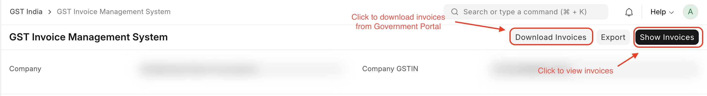
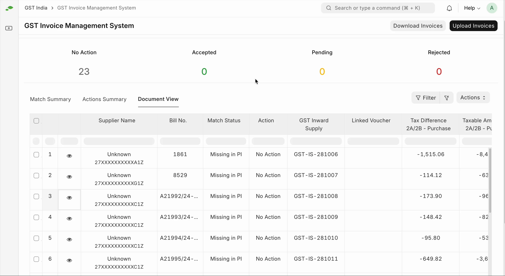
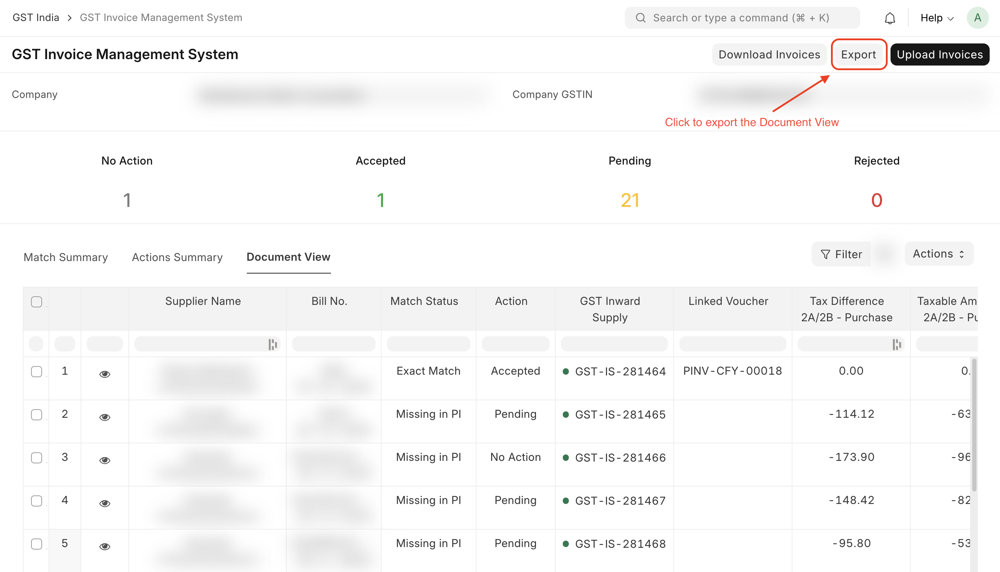

# Invoice Management System

The Invoice Management System (IMS) helps businesses efficiently manage transactions. It allows taxpayers to accept, reject, or
mark transactions for later review, making the reconciliation process simpler and improving accounting accuracy.

## GST Invoice Management System (IMS)

### Overview

When a business purchases goods or services, it pays GST on those purchases. It can then claim Input Tax Credit (ITC) for the sales made from those goods or services. However, the buyer can only claim ITC if the supplier has filed the sale in their GSTR-1/1A/IFF. If the supplier fails to file GSTR-1 or reports incorrect information, the buyer may not be able to claim the credit.

### Key Features

- **Accurate ITC Claims**: Ensures only accurate and valid invoices are considered for ITC claims.
- **Invoice Display**: Displays invoices that do not have reverse charges and are eligible for ITC, reported by your supplier in GSTR-1/1A/IFF.
- **Action Options**: Allows you to accept, reject, or mark invoices as pending.

### Workflow

1. **Supplier Filing**:

   - Only invoices filed by the supplier will be included in the ITC calculation.

2. **Reconciliation**:

   - Match inward supplies downloaded from the government portal to the purchases from the system to identify which invoices need to be accepted, rejected, or marked as pending.

3. **Invoice Actions**:

   - **Accept**: Includes the invoice in the ITC calculation.
   - **Reject**: Excludes the invoice from the ITC calculation.
   - **Pending**: Excludes the invoice from the ITC calculation but will remain in IMS.

4. **Automatic Acceptance**:

   - If no action is taken on an invoice, it will automatically be deemed accepted.
   - A draft GSTR-2B will be generated, including only the accepted or no-action-taken invoices on the 14th of the following month.

5. **Regenerate GSTR-2B**:

   - After applying the actions in IMS, regenerate GSTR-2B to reflect the latest status of invoices.

6. **Populate GSTR-3B**:

   - Based on the regenerated GSTR-2B, GSTR-3B will be populated, which demonstrates how the IMS significantly enhances the efficiency and accuracy of the complete filing process.

### Benefits

- **Streamlined ITC Process**: The flow between GSTR-1/1A/IFF and GSTR-2B through the IMS helps streamline the process of claiming ITC while ensuring that all invoices are accurate.
- **Flexibility**: Taxpayers can modify their actions on invoices until they file Form GSTR-3B for the month.

> Note: Invoices that are not eligible for ITC, either because of the POS rule or Section 16(4) of the CGST Act, will not be displayed on IMS and will instead be directly displayed in the ITC Not Available section of GSTR-2B.

## Download Invoices from GSTN

To take action on invoices filed by your supplier, you first need to download those invoices from GSTN. Here’s how:

- Navigate to **Accounting > GST India > GST Invoice Management System** or simply search for **GST Invoice Management System** in awesomebar.

- Click **Download Invoices**. Now, the invoices will be scheduled to be downloaded from GSTN, and you will be notified once the download is completed.

- Click on **Show Invoices** and a summary of Inward Supplies will be displayed on the screen in the **Document View** Tab.

## Review Transactions

After the invoices reported by your supplier are downloaded from GSTN, they will be categorized under **Exact Match**, **Suggested Match**, **Mismatch**, **Manual Match**, or **Missing in PI**. You can either accept, reject, or mark the transactions as pending after verifying them with the Purchase transactions. Here’s how:

- Navigate to the **Match Summary** Tab where you can view the summary of invoices based on match status.

- You can perform reconciliation through the **Document View** tab in the GST Invoice Management System. The reconciliation process here closely resembles the functionality of the Purchase Reconciliation Tool. For a detailed understanding, refer to [this guide](https://docs.indiacompliance.app/docs/purchase-reconciliation/reconciling_purchase#reconciliation).

- You can also perform following actions on invoices:

| Action    | Description                                                                                                      |
| :-------- | :--------------------------------------------------------------------------------------------------------------- |
| Accepted  | The invoices that are accepted will be included when generating GSTR-2B.                                         |
| Rejected  | These invoices that will not be included when generating GSTR-2B.                                                |
| Pending   | The invoices that are marked as pending will remain in the IMS and will not be included when generating GSTR-2B. |
| No Action | These invoices will be deemed accepted at the time of generating GSTR-2B.                                        |

- Navigate to the **Actions Summary** Tab where you can view the summary of invoices based on actions taken.

::: info

1. You cannot **Accept** invoices where match status is **Missing in PI**.
2. When an invoice is unlinked and IMS action is **Accepted**, then IMS action will automatically revert to **No Action**.
   :::

## Upload to GSTN

The actions taken on the downloaded invoices need to be updated on the GSTN. Here’s how you can do it:

- Click **Upload Invoices** in the top right. Now, the invoices will be scheduled to be uploaded to GSTN, and you will be notified once the upload is completed.

- If any invoices fail to upload to GSTN, you can redownload and reupload them using the option provided in the dialog box.

::: tip
As a best practice, download invoices from GSTN before uploading to ensure data accuracy and maintain consistency.
:::

## Export Data

To export the **Document View** of the GST Invoice Management System, click the **Export** button
at the top right corner.

## FAQs

### From which version is GST Invoice Management System supported?

This feature is supported starting from **version-15** of the India Compliance App.

### When will the Invoice Management System be ready for use?

This feature has started functioning from the 14th of October 2024.

### How will my seller send me these invoices through IMS?

The moment your seller adds their invoices to the GSTR 1/IFF/1A, the records will be automatically populated in your IMS dashboard and will be ready for you to take action.

### What actions can I take in the IMS and will my sender be able to see my action on their invoices?

You can accept, reject, or leave the invoice pending without taking any action. Yes, your seller will be able to see the actions you take on your invoice. You should also note that the pending records will be available for you to take actions in the future months.

### In what cases do my invoices get marked as accepted?

When you do not take any action on your invoices or the records sent by your seller, the invoices will be marked as accepted and will be added to your GSTR-2B. Your invoices will also be marked accepted when you do so.

### How long do I have before taking any action on the invoices?

Your time to take action (accept, reject, or leave as is) starts from the time your supplier adds a record in GSTR 1/IFF/1A and ends before you file your GSTR-3B. If you don't take any action, the invoice will be marked as accepted and will be automatically sent to your GSTR-2B.

### What happens if my supplier modifies the invoices after sending them to me?

If they make changes before GSTR-1, then the modified invoices will replace the originals without considering what action you performed on them. If they make changes to the invoices filed in GSTR-1 through GSTR-1A, even then the invoice will get populated in your IMS dashboard but the ITC will flow in your next month's GSTR-2B only.

### When should I recompute GSTR 2B from the IMS dashboard?

You need to recompute GSTR 2B if there are any changes in the actions performed on the records or, otherwise, if you take any action after the 14th of the month. If neither occurs, there will be no requirement for recomputation on your side.

### Which supplies are not processed through IMS and go directly to GSTR 3B?

Supplies that fall into the following categories will go directly to GSTR 3B:

- Inward RCM supplies reported in Table 4B of IFF/GSTR 1 or GSTR 1A.
- Supplies where ITC is not eligible due to section 16(4) of CGST Act or POS rules.

### Can I make changes after my GSTR-3B?

No, IMS does not allow you to take actions on the invoices after you file your GSTR-3B for the same month. Your GSTR-2B for the next month will not be generated until you file your GSTR-2B.

### How does the IMS function or what is the workflow of IMS?

All the outward supplies reported in GSTR 1, IFF, or 1A will appear in your IMS. You have three action options that you can make on the records:

- **Accept**: When you accept a record, it will be added to the ITC Available section of GSTR 2B. The GST on these records will automatically populate in GSTR 3B as eligible ITC.
- **Reject**: When you reject a record, it will fall into the ITC Rejected section of GSTR 2B. The ITC from these rejected records will not be added to GSTR 3B.
- **Pending**: If you leave an invoice and it gets marked as "pending," it won't appear in GSTR 2B or GSTR 3B. These pending records will stay on the IMS dashboard until you accept or rejects them. However, you cannot mark certain types of records as pending.

  These types of records include:

  - Original credit notes.
  - Upward amendments of credit notes (no matter what action was taken on the original credit note).
  - Downward amendments of credit notes if the original credit note was rejected.
  - Downward amendments of invoices or debit notes if the original was accepted and GSTR 3B was already filed.

For more FAQS, you can refer to the following links:

- [Initial FAQs](https://tutorial.gst.gov.in/downloads/news/final_faqs_on_ims_22_09_2024.pdf)
- [Additional FAQs](https://tutorial.gst.gov.in/downloads/news/final_faqs_on_ims_22_09_2024.pdf)
