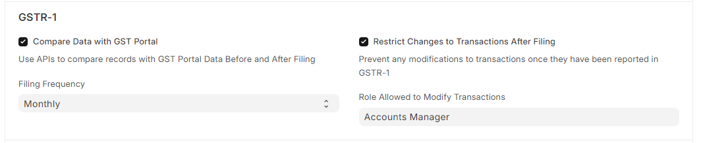
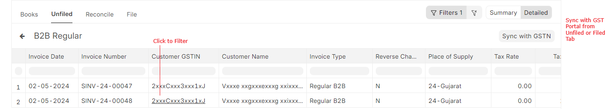
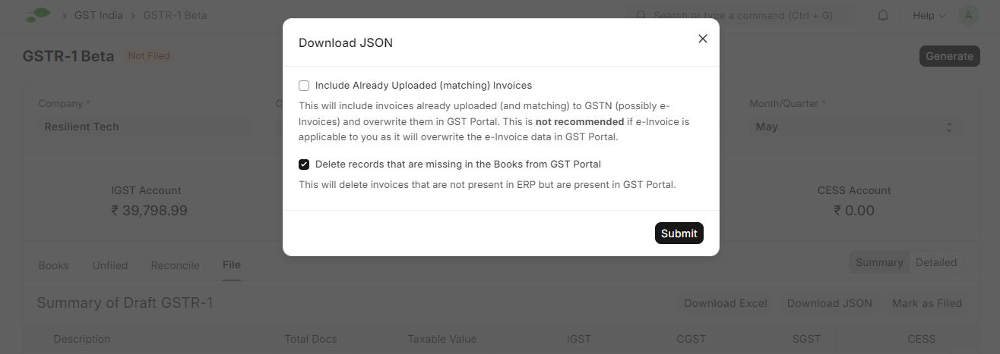
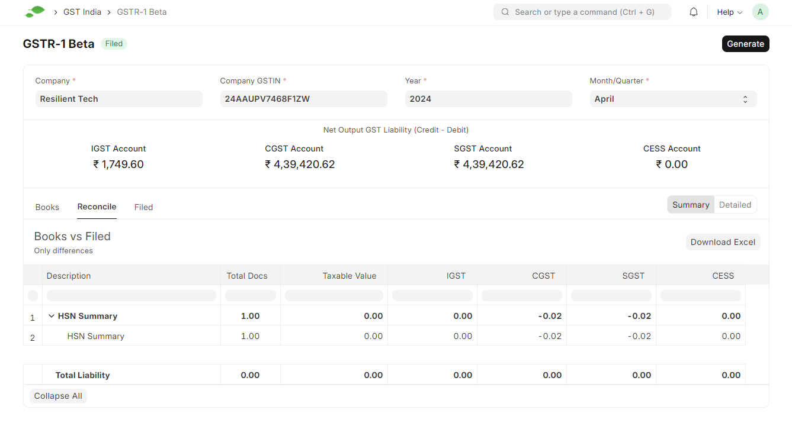
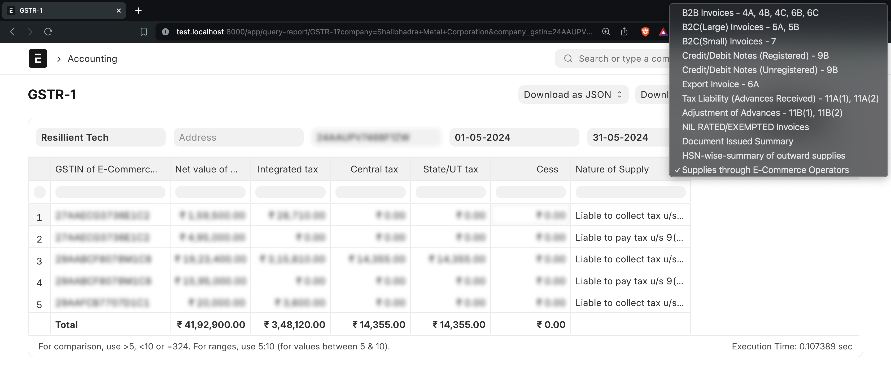

# GSTR-1

India Compliace App helps you generate GSTR-1 Report, export it in JSON, or Excel, and utilize it for effectively file GSTR-1 returns.

## GSTR-1 Beta

### Feature Highlights

Simplify GSTR-1 filing, and file with confidence using the GSTR-1 Beta.

- **Seamless API Integration:** Effortlessly fetch unfiled/filed data from the GST Portal for comparison before and after filing GSTR-1.
- **Comprehensive Overview:** Access to complete overview of Ledger Balances, Transactions, and data as per GST Portal.
- **Enhanced Control:** Prevent modifications to Sales Invoices once GSTR-1 is filed, ensuring data integrity.

### Setting up

To get stated with GSTR-1 Beta, make sure you have completed the following steps:

#### Configure GST Settings

Navigate to **GST Settings** and configure settings related to GSTR-1. 

- **Compare Data with GST Portal:** Enable this feature to utilize API functionalities for fetching filed data from the GST Portal for comparison.
- **Filing Frequency:** Choose between Monthly or Quarterly filing frequencies for GSTR-1.
- **Restrict Changes to Transactions After Filing:** Enable restrictions to prevent changes to Sales Invoices after filing GSTR-1, maintaining consistency with the data submitted to the GST Portal.
- **Role Allowed to Modify Transactions:** Designate specific roles authorized to modify transactions (Sales Invoices) after filing GSTR-1.

If you wish to use API related features, make sure credentials are set up for service `Returns`.

#### Enable API Access on GST Portal

If you plan to leverage API features, make sure that API access is enabled on the [GST Portal](./../purchase-reconciliation/purchase_reconciliation_setup#configuration-on-gst-portal).

### Generate GSTR-1

Navigate to **GSTR-1 Beta** and select the period and company for which you want to generate the GSTR-1 report. Click on the `Generate` button.

For API features, an OTP may be required for authentication; input the received OTP from your registered contact details.

The generation process of GSTR-1 is queued and may require some time to finalize.

### Navigate through GSTR-1

- Filing Status: Shows the status of the GSTR-1 Filing for the selected period.
- Net Output GST: Presents the balance in GST Output Ledgers (Credit - Debit).
- Tabs Navication: Easily navigate through various Tabs to access specific data.
- Tab Actions: Perform actions like downloading data in Excel or JSON format, syncing data with the GST Portal, and more.
- Detailed Views: Click on sub-categories to delve into detailed data.

### Compare, Export, and File

**More control with JSON Export**

- Exclude previously uploaded data from JSON export.
- Delete transactions in the GST Portal that are absent in your books.

### Compare Historical Data

## GSTR-1 Report (Legacy)

::: danger IMPORTANT
This is a legacy feature and will be deprecated in v16. Please use the GSTR-1 feature as described above.
:::

To generate GSTR-1 Report in ERPNext navigate to

**Accounting > Goods and Services Tax (GST India) > GSTR-1 Report**

or simply search for GSTR-1 Report in awesomebar.

- Enter the following details to generate the report:

    1. Company Name
    2. Company Address linked to the GSTIN for which the report is to be generated
    3. From Date
    4. To Date
    5. Type of Business

- Click `Download as JSON` to create JSON.

You can also Export report in Excel or CSV.

