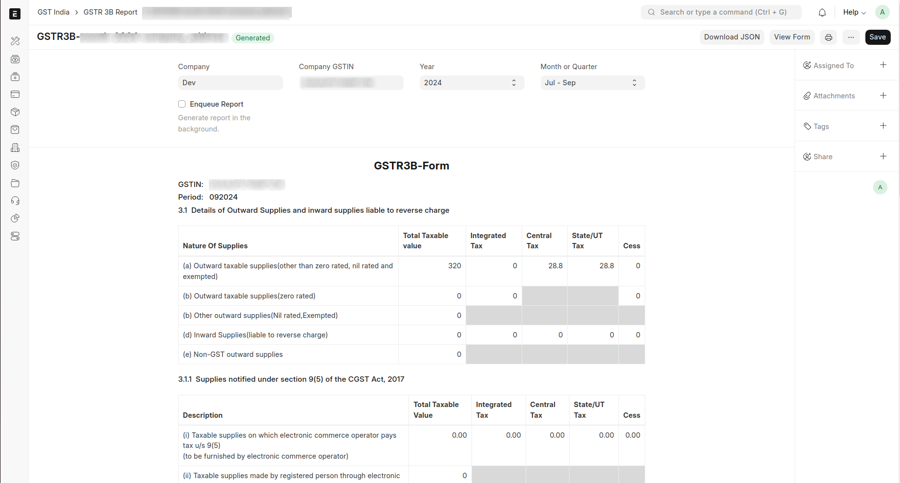
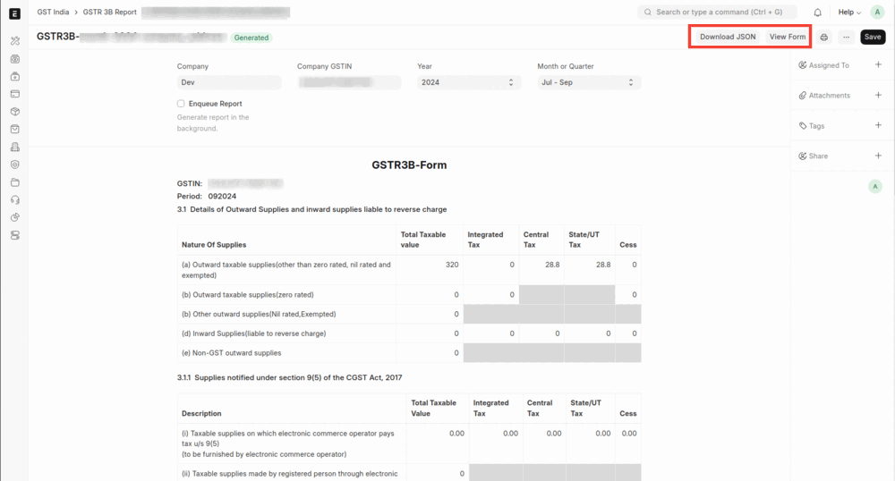
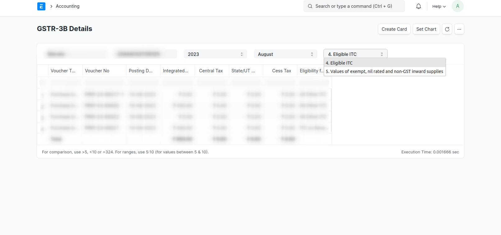
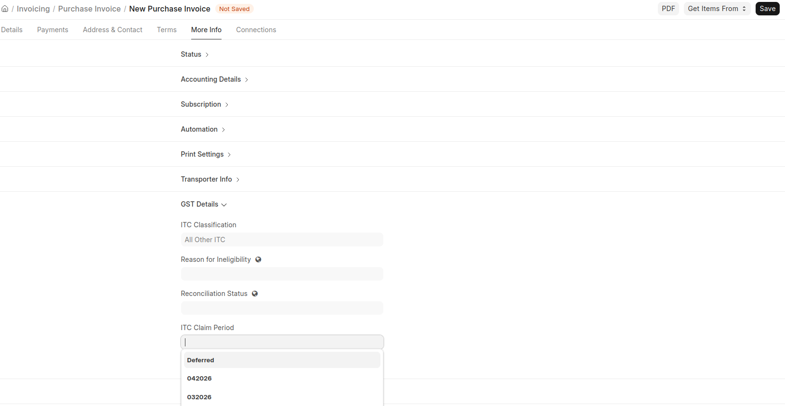
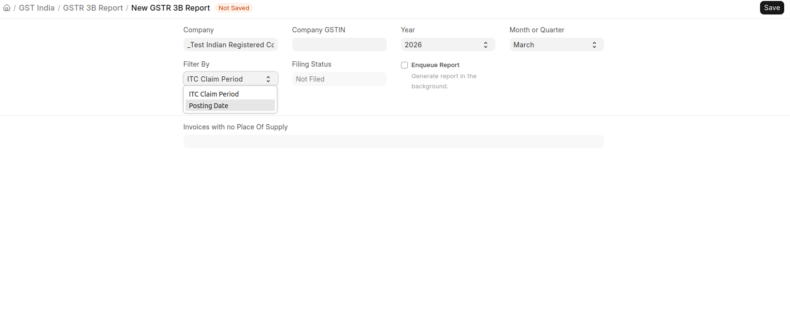

# GSTR-3B

This guide will help you generate GSTR-3B Report in ERPNext.

## GSTR-3B Report

To generate GSTR-3B Report in ERPNext navigate to

**Accounting > Goods and Services Tax (GST India) > GSTR 3B Report**

or simply search for GSTR 3B Report in awesomebar.

- **GSTR-3B now supports generating the report based on Month or Quarter.**

- Click New to generate a new report or select an existing report to update it
  or download JSON.

- Enter the following details to generate the report:

  1. Company Name
  2. Company GSTIN
  3. Year
  4. Month or Quarter

- Click Save to generate the report and view form. An existing report can also
  be updated/regenerated on clicking save.

If you want to print the report it can also be printed and viewed in GSTR-3B
Form by clicking on View Form as shown below

## GSTR-3B Details Report

The GSTR-3B Details Report provides detailed information on all the purchase
transactions that are included in the GSTR-3B report.

## ITC Claim Period

Use **ITC Claim Period** to decide in which month ITC should be claimed for inward documents such as Purchase Invoices and Bills of Entry.

This is useful when the document is posted in one month, but you want to claim ITC in a later month (for example, due to supplier filing timelines or internal compliance checks).

### How India Compliance Sets ITC Claim Period

#### Document Creation

When you create a document and do not set the field manually, ERPNext sets it automatically:

1. Start from the posting period, or the later of the posting period and the 2B return period when a 2B period is available.
2. Move forward to the next unfiled period, up to the Section 16(4) deadline.

#### IMS

If IMS actions are available, they take priority:

1. If the IMS action is **Rejected** or **Pending**, the period is set to `Deferred`.
2. If the IMS action is **Accepted** and an IMS period is available, that period is used.
3. If the matched inward supply has an IMS action of **Rejected** or **Pending**, the period is set to `Deferred`.
4. Otherwise, the document creation logic above applies.

### Validation Rules

- The period must be in `MMYYYY` format or `Deferred`. Any other value is rejected.
- You cannot set the claim period to a period whose GSTR-3B has already been filed.

### Behavior in Reports

All GST reports related to purchase transactions support filtering by **Posting Date** and **ITC Claim Period**.

When you choose **ITC Claim Period**, inward transactions are picked based on the selected claim period instead of posting date.

#### GSTR-3B

In GSTR-3B:

- Outward RCM liability always follows **Posting Date**.
- Inward RCM ITC follows **ITC Claim Period** when that filter is selected.

So, an RCM invoice posted in one month and claimed in another month appears as follows:

| Report period | Outward RCM liability | ITC on reverse charge (ISRC) |
|---|---|---|
| Posting month (M) | Included | Not included |
| Claim month (M+1) | Not included | Included |

### Example Scenario

#### Quarterly Purchase Invoice with ITC Deferred to Next Month
**Scenario**: You receive a Purchase Invoice in April from a supplier who files quarterly (April to June). The invoice appears in GSTR-2B only after the supplier files for June.

**What to do**:

1. Book the Purchase Invoice normally in April. The system auto-sets the ITC Claim Period based on your GSTR-2B data.
2. Since the invoice is not yet reflected in GSTR-2B, manually set the **ITC Claim Period** to `Deferred` to exclude it from ITC until the supplier's quarterly return is filed.
3. Once the supplier files in June and the invoice appears in GSTR-2B, update the **ITC Claim Period** to `062026` (June 2026) and generate the **June GSTR-3B**: the ITC will now be included correctly.

#### RCM Purchase Invoice with ITC Claimed in a Different Month

**Scenario**: You post an RCM Purchase Invoice in April and claim ITC in May after meeting your payment/compliance conditions.

**What to do**:

1. Book the RCM Purchase Invoice in April. The system auto-sets the ITC Claim Period to `042026`.
2. Manually update the **ITC Claim Period** to `052026` (May 2026).

> **Note**: Outward RCM liability always follows **Posting Date**. Inward RCM ITC follows **ITC Claim Period** when that filter is selected, or **Posting Date** when report filter is Posting Date.
