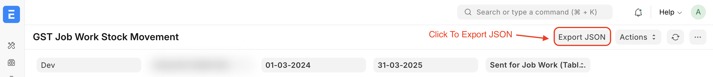

# Miscellaneous Reports

Other useful reports in India Compliance App to help you with your GST
compliance.

## GST Job Work Stock Movement Report

The report provides detailed information on inputs, capital goods, or
semi-finished goods sent to job workers, goods returned, and any inter-job
worker transfers.

To generate GST Job Work Stock Movement Report in ERPNext navigate to

**Accounting > Goods and Services Tax (GST India) > GST Job Work Stock Movement
Report**

or simply search for GST Job Work Stock Movement Report in awesomebar.

- **Received back from Job Worker** category provides data on stock transfers
  received from the job worker after the completion of subcontracted tasks.

- **Sent for Job Work** category provides data on stock transfers sent to the
  job worker for subcontracting.

Refer [here](https://docs.indiacompliance.app/blog/posts/post5) for the detailed Subcontracting Workflow in ERPNext for Indian Compliance.

### Export JSON Data

To export JSON data, follow these steps:

- Click the **Export JSON** button located at the top right corner of the screen to initiate the download.
 Your JSON data will be saved to your device.
- Once downloaded, you can upload this JSON data to the government portal as required.

## GST Balance Report

The GST Balance Report provides the balance of GST Accounts for a given period.
It also provides the balance summary for each GSTIN.

To view GST balance report navigate to **Accounts > GST India > GST Balance**

or simply search for GST Balance in awesomebar.

::: info
You may need to update GSTIN in documents where GST Number is not set.
We have provided a tool to update GST Number in all documents. However, in a
multi-company setup, you'll need to manually update for each document, as GSTIN
cannot be determined.
:::

## GST Sales Register Report

The GST Sales Register Report provides:

- An overview of all sales transactions made during a specified period.
- Item-Wise summary of transactions.
- HSN-Wise summary of transactions.

To view GST Sales Register report navigate to **Accounts > GST India > GST
Sales Register**

or simply search for GST Sales Register in awesomebar.

## GST Purchase Register Report

The GST Purchase Register Report provides:

- An overview of all purchases made during a specified period.
- A comprehensive summary based on various categories
- A detailed breakdown of each transaction based on category.

To view GST Purchase Register report navigate to **Accounts > GST India >
GST Purchase Register**

or simply search for GST Purchase Register in awesomebar.

