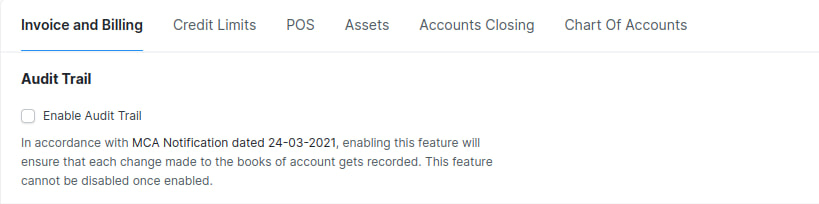
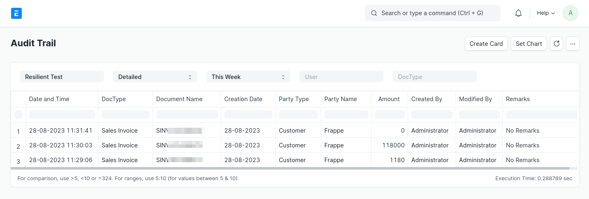

# Audit Trail
The Audit Trail feature in India Compliance App allows you to keep a record of all actions taken within the app by each user. This feature is useful for compliance purposes and ensures accountability for actions taken within the app.

In India, the Companies Act requires all companies registered in the country to maintain an Audit Trail of each and every transaction and creating an edit log of each change made in books of account. This requirement came into effect on 1st April 2023. You can read more about the MCA Notification [here](https://www.mca.gov.in/Ministry/pdf/AccountsAmendmentRules_24032021.pdf).

A similar feature called [Document Versioning](https://docs.erpnext.com/docs/v14/user/manual/en/using-erpnext/document-versioning) is already available in ERPNext but this wasn't sufficient. As per the notification, companies shouldn't be able to disable such a feature and this is where Audit Trail feature comes in.

## Feature Highlights
1. This feature can be enabled from Accounts Settings or from Setup Wizard.
1. Once this feature is enabled, it cannot be disabled.
1. Accounts Settings with respect to Delete Accounting and Stock Ledger Entries on deletion of transaction will be disabled and made read-only. Hence it wouldn't be possible to delete any accounting and or stock transaction.
1. Document Versioning or Track Changes would be enabled for all accounting and stock transactions by default and cannot be disabled or overridden



## What is recorded with document versioning?
You can refer to the [official documentation](https://docs.erpnext.com/docs/v14/user/manual/en/using-erpnext/document-versioning) for the same.

To summarize, it records the following information:

1. User who performed the action
1. Date and time of the action
1. Type of action (e.g. create, update, delete)
1. Details of the action (e.g. which data was updated)

## Documents where Track Changes are enabled

Documents for which Audit Trail is enabled and made mandatory are as follows ([reference](https://github.com/resilient-tech/india-compliance/blob/develop/india_compliance/hooks.py#L203)):

- Accounts Settings
- Dunning
- Invoice Discounting
- Journal Entry
- Payment Entry
- Period Closing Voucher
- Process Deferred Accounting
- Purchase Invoice
- Sales Invoice
- Asset
- Asset Capitalization
- Asset Repair
- Loan Balance Adjustment
- Loan Disbursement
- Loan Interest Accrual
- Loan Refund
- Loan Repayment
- Loan Write Off
- Delivery Note
- Landed Cost Voucher
- Purchase Receipt
- Stock Entry
- Stock Reconciliation
- Subcontracting Receipt
- POS Invoice
- Bill of Entry

## Audit Trail Report

The Audit Trail Report provides a detailed history of all changes made to documents in the system. This includes the user who made the change, the date and time of the change, and the type of change. The report can be viewed by doctype or user, and it provides all important and relevant details about the document generated.



The Audit Trail Report is a valuable tool for tracking changes to documents in the system. It can be used to identify who made changes to a document, when the changes were made, and what type of changes were made. This information can be used to investigate problems, identify unauthorized changes, and ensure that documents are accurate and up-to-date.

## Adding custom doctypes

If you have custom doctypes that you would like to enforce Audit Trail on, you can do so by adding them to the `audit_trail_doctypes` hook. Here's how:

1. Navigate to your custom app and create a new hooks.py file if you haven't already done so.

1. Inside the hooks.py file, add the following code:

```py
audit_trail_doctypes = [
	"Sales Invoice",
	"Custom Doctype Name",
	...
]
```

Replace "Custom Doctype Name" with the name of the custom doctype that you want to enforce Audit Trail on.

1. Save the hooks.py file.

1. Migrate your site to enforce the Audit Trail feature on the custom doctype by running the following command:

```sh
bench migrate
```

After following these steps, the Audit Trail feature will be enforced on the custom doctype that you specified in the `audit_trail_doctypes` hook.

## Conclusion
Enabling the Audit Trail feature in your app is important for compliance purposes and ensures accountability for actions taken within the app. By following the steps outlined in this documentation, you can also enforce the Audit Trail feature on custom doctypes in your app.