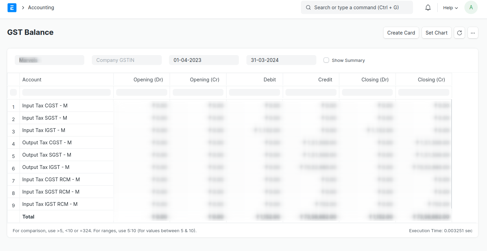

# GST Reports

ERPNext comes with most of your reports you need to prepare your GST Returns.

## GSTR3B Report

To generate GSTR3B Report in ERPNext navigate to

**Accounting > Goods and Services Tax (GST India) > GSTR 3B Report**

or simply search for GSTR 3B Report in awesomebar.

- Click New to generate a new report or select an existing report to update it or download JSON.

- Enter the following details to generate the report:

    1. Company Name
    2. Company Address linked to the GSTIN for which the report is to be generated
    3. Year
    4. Month

- Click Save to generate the report. An existing report can also be updated/regenerated on clicking save.

After saving you can see the JSON output in the text field below which can also be downloaded by using the Download JSON button in the top right corner as shown in the image below.

If you want to print the report it can also be printed and viewed in GSTR3B Form by clicking on View Form as shown below

## GSTR-3B Details Report

The GSTR-3B Details Report provides detailed information on all the purchase transactions that are included in the GSTR-3B report.

## GSTR-1 Report

To generate GSTR-1 Report in ERPNext navigate to

**Accounting > Goods and Services Tax (GST India) > GSTR-1 Report**

or simply search for GSTR-1 Report in awesomebar.

- Enter the following details to generate the report:

    1. Company Name
    2. Company Address linked to the GSTIN for which the report is to be generated
    3. From Date
    4. To Date
    5. Type of Business

- Click `Download as JSON` to create JSON.

You can also Export report in Excel or CSV.

## GST Balance Report

The GST Balance Report provides the balance of GST Accounts for a given period.
It also provides the balance summary for each GSTIN.

To view GST balance report navigate to **Accounts > GST India > GST Balance**

or simply search for GST Balance in awesomebar.

::: info
You may need to update GSTIN in documents where GST Number is not set.
We have provided a tool to update GST Number in all documents.However, in a multi-company setup, you'll need to manually update for each document, as GSTIN cannot be determined.
:::
