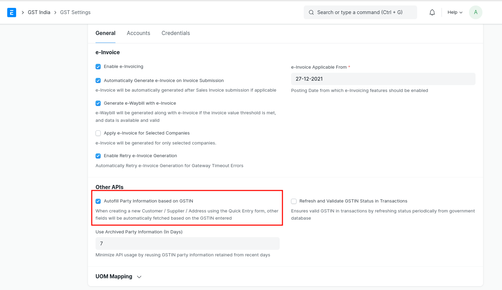
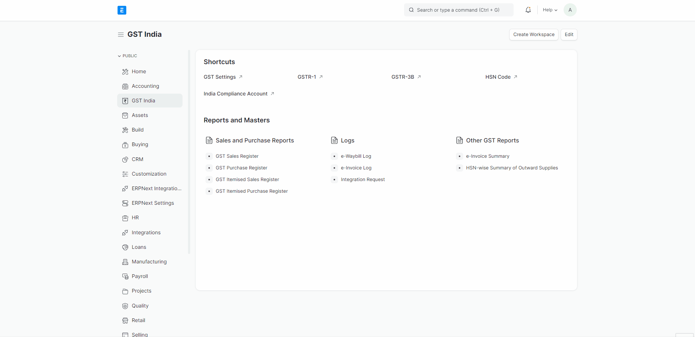

# GSTIN Verification
Whenever you do business with a new party, you can validate the GSTIN/UIN information provided by the party. It is recommended to validate GSTIN information while creating a party ledger. It ensures that the information entered in the Party ledger is authentic, and you can then make corrections immediately if needed.

India Compliance facilitates quick online validation of GSTIN and UIN related information.

### Steps to Enable Auto-GSTIN Verification
- [Setup GSP Credentials](../ewaybill-and-einvoice/gst_settings#gsp-credentials) 
- Enable API Features under GST Settings.
- Enable **`Autofill Party Information based on GSTIN`** fron GST Settings Tab.

## How to Validate GSTIN ?
**When creating a new Customer/Supplier/Address using the *Quick Entry form*,other fields will be automatically fetched based on the GSTIN Number entered.**

