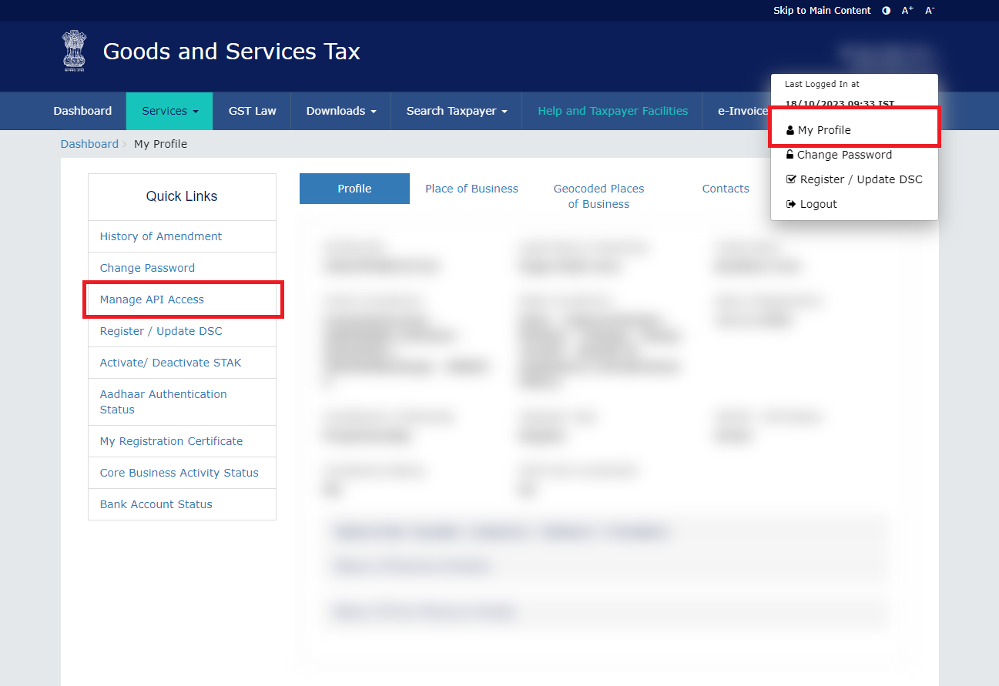
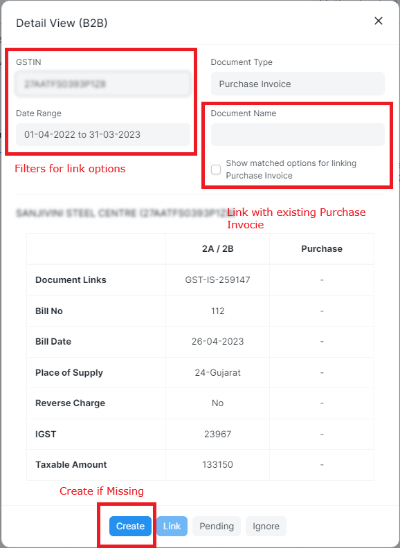

# Advanced Purchase Reconciliation Tool

As per GST laws, a business is required to file GSTR-3B after taking into consideration the input tax credit available as per GSTR-2B. 

Moreover, there are rules that share the responsibility of the business to ensure suppliers have filed GSTR-3B as well. This is where the Advanced Purchase Reconciliation Tool comes in.

## Feature Highlights

- Dual reconciliation: Reconcile both 2A and 2B in one go.
- Advanced algorithm: Complex yet performant algorithm ensuring even PAN level matching for accuracy.
- One-click report: Download and share your report with vendors in a click.
- Easy purchase creation: Quickly generate missing purchases to maximize your input credits.
- Click Less, Do More: Bulk actions to help you narrow down to unreconciled entries.
- Secure: End-to-end encryption with GST Portal to ensure your data is safe.

    <iframe style="position: absolute; top: 0; left: 0; width: 100%; height: 100%;"  src="//www.youtube.com/embed/hDRGq0dlP_c?autoplay=1&amp;feature=oembed&amp;wmode=opaque" frameborder="0" allowfullscreen>
    </iframe>

## Configuration

- Enable API Access by logging into your GST Account. My Profile --> Manage API Access --> Enable API Access

- Add the credentials to GST Settings. Password is **not** required as it is authenticated with OTP. The username is the same that you use to log into the GST Portal at gst.gov.in.

## Download GSTR2A and GSTR2B

You will see an option to download GSTR2A and GSTR2B in the Purchase Reconciliation Tool. When you actually try downloading, an encrypted session will be initialized between GST Portal and your site. You will receive OTP, which you can enter and proceed with download.

There could be instances where because of too many records, the GST portal would queue your request for GSTR2A. In such cases download would be retried every few minutes until the file is available for download.

On download following records are created:
- *GST Inward Supply:* This is the invoice level record that is created for each invoice in GSTR2A and GSTR2B
- *GSTR Import Log:* This helps in tracking the monthly download status for GSTR2A and GSTR2B

## Upload GSTR2A and GSTR2B

This option is only visible if APIs are disabled for your site. You can download JSON files manually from the GST Portal and upload them here for reconciliation. A similar GST Inward Supply and GSTR Import Log will be created for the uploaded files.

## What is fundamental difference between GSTR2A and GSTR2B? Should I download both?

GSTR2B is a **static record** for new Input Credit available since the generation of last GSTR2B. Invoice in current GSTR2B may relate to any previous period. Only the invoices for which GSTR1 is filed by the supplier are available in GSTR2B.

GSTR2A is a **dynamic record**. This will give information about invoices as on the date.

eg: If your supplier files the GSTR1 of April 2023 on 20th May 2023, then the invoices will be available in GSTR2A (of April 2023) after 20th May 2023. However the same will be available in GSTR2B of May 2023 since GSTR2B of April 2023 was already generated on 14th May 2023.

### Why is GSTR2B Important?
As required by GST laws, this should be used as a base for filing GSTR3B.

### Why is GSTR2A Important?
This gives a lot more valuable information about invoices than that available in GSTR2B.
- Live GSTIN Status as on the date of download.
- GSTR3B Filing Status of the Invoice.
- Invoices already uploaded as of the date to GSTR-1 (even though it may not be filled yet).

This additional information could be useful while releasing the vendor payments.

Hence usually GSTR2B is only downloaded once a month, but GSTR2A for the current fiscal year is downloaded every few days.

## Reconciliation

### Understaning which documents shall be considered for reconciliation
- Purchase Period: This will return purchases during this period where no match is found.
- Inward Supply Period: Returns all documents from GSTR2A/2B.

#### Recomended Filters and how to change them
- In case your site **doesn't** have too many records Purchase Period and Inward Supply Period can be set as `This Fiscal Year`.
- In case you have too many records: Use `This Fiscal Year` for Purchase Period and `This Quarter` or `Last Month` for the Inward Supply Period. *This will ensure that unmatched transactions for current fiscal year are carried forward for reconciliation in the next quarter/month.*
- In case you have previous years' unreconciled purchases: Use a longer period for the Purchase Period. eg: `Last 2 Fiscal Years`

### Bulk Actions
Objective: Purchase Reconciliation Tool is a single doctype and your last reconciliation status is never saved. Instead matching of invoices or actions performed for each individual transaction is saved in GST Inward Supply. This information is then recompiled with newly available information and presented to you in Purchase Reconciliation Tool.

- **Ignore:** You can ignore few transactions if they are not financially important for you and you don't expect a match in the future. eg: Incorrectly showing in GSTR2A/2B or transactions of transporter where accuracy is less important because you already pay tax on reverse charge basis.

- **Pending:** You can mark few transactions as pending if you expect a match in the future. eg: Transactions of vendors who have not yet filed GSTR1 for the period.

Bulk actions can be performed in any of the tabs and it would then be applied to all transactions within the group of match or supplier applied.

These can then be filtered out to narrow down to unreconciled transactions.

### Quick Filter
You can quickly filter out transactions based on

- Match Status: from match summary tab --> By clicking on Match summary
- Supplier GSTIN: from a supplier or document view --> By clicking on Supplier GSTIN

### Processing Individual Transactions
Once you have narrowed down to unreconciled transactions, you can process them individually.

- Match Available: You can unlink the match if you think the match is incorrect. This will then be available for reconciliation again. Or you can accept the match if you think the match is correct.

- Missing in Purchase: You can **create** a purchase for the transaction if you think the transaction is missing in your books. This will then be reconciled automatically. You can also link this with any existing transaction from GST Inward Supply.
- Missing in GSTR2A/2B: You can link the transaction with any existing transaction from Purchase Invoices or Ignore it if you think the transaction is not important for you.

### Sharing Reports with Vendors
Finally, you can download the report and share it with your vendors. This report will contain all the transactions that are missing in your books and the transactions that are missing in GSTR2A/2B. This comes preformatted and highlights the important differences to you.

