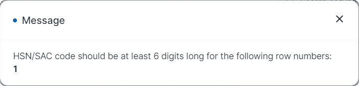

# Validations

India Compliance comes with Powerful validations to ensure correct compliance.  
All the validations are in accordance with the law and regularly updated.

## Missing Fields
Missing fields could be the reason for the failure of an e-Invoice or e-Waybill.
India Compliance ensures all fields are valid before submitting the data.
Mode Of Transport, Transporter Name or ID is entered or not; all the fields in address like state number, and pin code, are present.

## Pincode
The master database of the e-invoicing system has a state master which validates the PIN codes against the states. If a particular PIN code does not exist, it will match the first three digits of the PIN code with the PIN code to the state mapping pattern as defined by the postal department. Only after proper validation, an IRN will be generated.

## HSN Code
According to the GST Law, your itemized invoices must contain the HSN Code related to that item. India Compliance checks the validity of the HSN Code and ensures correct HSN with minimum code digit is present.

## Validity of e-Waybill
An e-way bill is valid for a particular period, which is based on the distance travelled by the goods. Validity is calculated from the date and time of generation of the e-way bill.
API checks validity before cancelling or updating.

## e-Waybill Applicability
There are some cases where the e-Waybill is not applicable.API checks for applicability before making a request.
For Non-GST-Items, e-waybills are not required. Warnings before generating e-Waybill for an invoice with Non-GST-Items.

## Duplicate IRN
If a taxpayer has already generated an IRN for a particular invoice number, then an IRN cannot be generated again on the same invoice number.API automatically updates IRN if IRN is already generated.

## Proper GST Account
Proper routing of GST Transactions to valid GST Accounts is very important.
India Compliance checks if the correct GST Account is selected for a particular transaction.

## Document Name
As per the provisions of GST, any document reported to GSTN or NIC should have a valid name.

- Should be alphanumeric
- It can contain dash (-) or slash (/)
- It cannot start with a special character or zero
- It should not exceed 16 characters

However, if your series names are suffixed for amendments (eg: `SINV-222-1` with `-1` for amendment), you should restrict the naming to 14 characters.

You can continue using default naming for amendments, by having appropriate configuration in the Document Naming Settings (so amendmed document would be like `SINV-223`).

This configuration is applicable for all documents reported through e-Waybill/e-Invoice/GSTR-1. Hence it is recommended to have a valid naming convention for all documents including Purchase Invoice, Purchase Receipt and Delivery Note.
