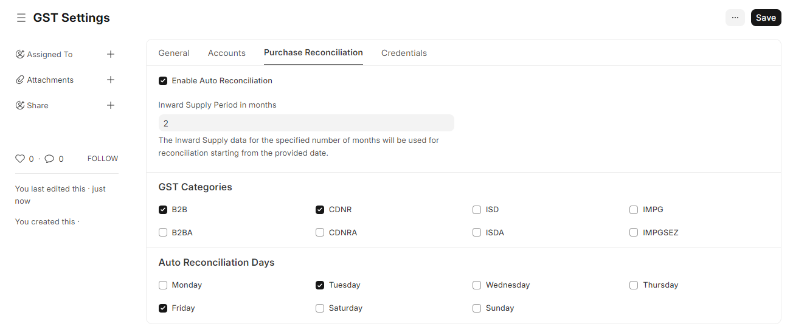
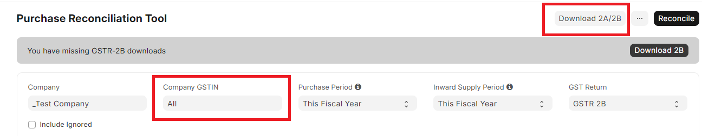

# Auto Reconcile Purchases

Run your purchase reconciliation process on Auto-Pilot with Auto Reconciliation feature. With e-Invoicing, invoices are auto-populated in GSTR-2A of the buyer in real-time. 

This feature is designed to automate the reconciliation process by fetching GSTR-2A and GSTR-2B data from the GST Portal and reconciling it with your purchase invoices on a perodic basis.

With this feature, you can:
- Save time and effort by automating the reconciliation process
- Ensure that your vendors are compliant
- Have better vendor payment workflows by knowing the status of your vendors' invoices

## Setup Auto Reconciliation

With this simple steps you can enable auto reconciliation for your site.

<Steps>
<Step title="Enable Auto Reconciliation">

Go to GST Settings and enable `Auto Reconciliation` from the Purchase Reconciliation tab.
</Step>
<Step title="Setup Number of Months">

This is the number of months for which the system will fetch GSTR-2A automatically. So if you set it to 2, the system will fetch GSTR-2A for the current and previous month.
</Step>
<Step title="Setup GST Categories">

Here you specify the GST Categories that must be downloaded from the GST Portal. Usually B2B and CDNR are the most important categories.

</Step>
<Step title="Setup Auto Reconciliation Days">

You can set the days of the week when the system should fetch GSTR-2A. eg: If you set it to Tuesday, the system will fetch GSTR-2A every Tuesday Morning. This could be useful if you are processing payments on every Tuesday.
</Step>
<Step title="Authenticate with OTPs">

Authenticate all your GSTINs once manually. For this, you can go to Purchase Reconciliation Tool and download GSTR-2A / 2B for all GSTINs. You will be prompted to authenticate with OTPs for each GSTIN. You'll need to do this every 30 days after your session expires.

</Step>
</Steps>

::: tip
These configurations would help in controlling the number of API requests made to the GST Portal. GSTR2A requires one API request for each category per month.
:::

::: warning
Make sure your session is active for [30 days](purchase_reconciliation_setup#configuration-on-gst-portal) to avoid frequent OTP authentications.
:::