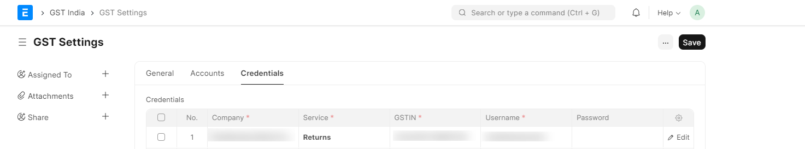

# Setting up Purchase Reconciliation Tool

## Configuration on GST Portal

- Enable API Access by logging into your GST Account. My Profile --> Manage API Access --> Enable API Access

## Configuration in ERP

- Add the credentials to GST Settings. Password is **not** required as it is authenticated with OTP. The username is the same that you use to log into the GST Portal at gst.gov.in.

